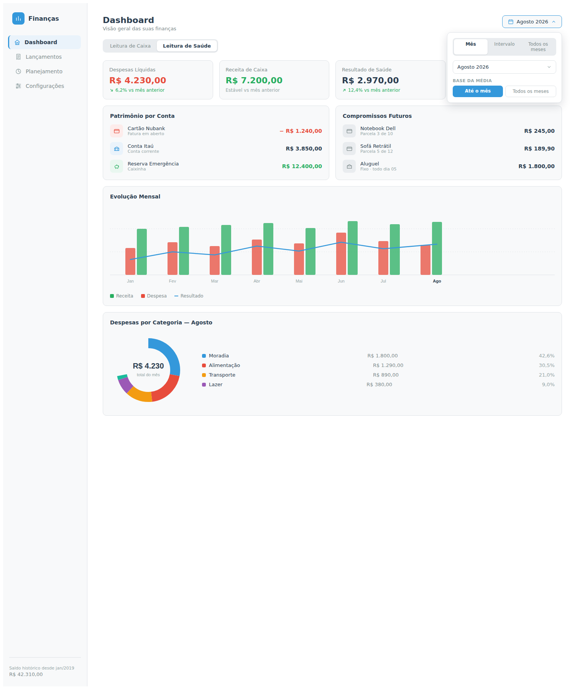
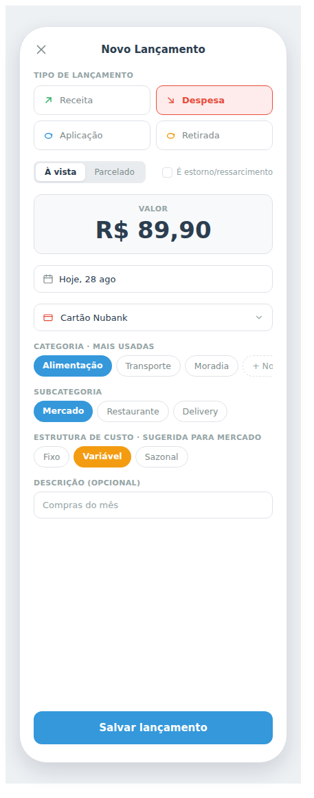
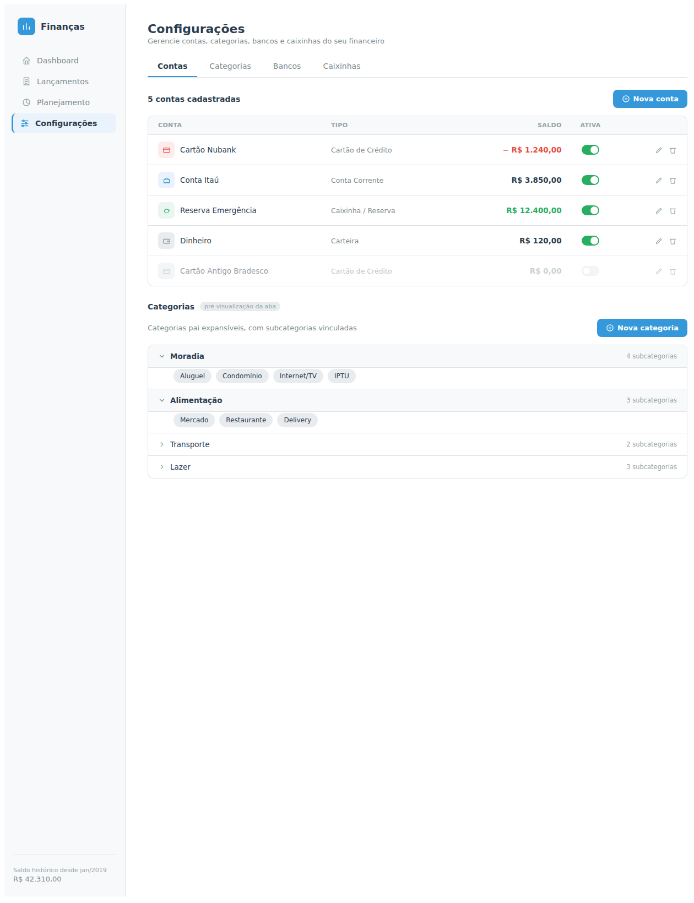
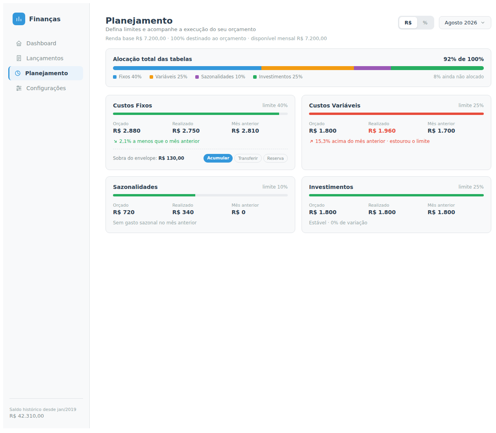

# Proposta original do redesign + Changelog — o que foi combinado x o que existe hoje

Este documento existe pra não perder o que foi desenhado no início do projeto,
quando o ZIP do app antigo (`v6_Estrutura_de_custos.zip`, Tkinter + relatório
HTML local) foi analisado e viraram 4 mockups de tela. Serve de referência pra
continuar o trabalho sem precisar redescobrir o que já foi decidido.

**Fonte:** artifact de design "Finance App Redesign", publicado a partir da
análise do ZIP original —
[ver mockups interativos](https://claude.ai/code/artifact/aca7d916-7ef2-4b93-b482-bce337d343ed).
As 4 telas também estão exportadas como PNG em `docs/mockups/` (abaixo, uma
por seção) — versionado, sem depender de login nem do artifact continuar no
ar. O ZIP em si não está neste repositório (foi um anexo de conversa, não um
arquivo versionado) — se quiser preservá-lo de forma durável, vale anexar de
novo e commitar num lugar como `docs/app-original/`. Ver também
`plano-de-evolucao-original.md` (a auditoria do ZIP e o plano de fases que
vieram antes destes mockups) e `sugestoes-e-decisoes-do-redesign.md` (a
rodada de perguntas e respostas que veio logo depois deles).

Cada seção abaixo lista o que o mockup propôs, o que existe hoje (código real,
não memória — conferido nos routers/telas na data deste documento) e o que
falta. Legenda: ✅ implementado · 🟡 parcial · ⬜ não implementado.

---

## Dashboard

Mockup: número de patrimônio no topo, seletor de mês com opções de intervalo,
alternância entre as duas leituras financeiras, KPIs com variação percentual
vs mês anterior, saldo por conta, compromissos futuros, evolução de 3 séries,
e despesas por categoria do mês.

| Proposto no mockup | Status | Observação |
|---|---|---|
| Saldo histórico / patrimônio total (topo, "desde jan/2019") | ⬜ | Ainda não existe — depende de contas terem saldo, e isso ficou de fora por decisão explícita (ver changelog 2026-09-13) |
| Seletor de mês | ✅ | `<input type="month">` |
| Intervalo (Todos os meses / mês específico) | ✅ | Tabs Mês/Intervalo/Todos os meses — Intervalo com 2 seletores de mês, Todos os meses calcula a partir de `GET /dashboard/primeiro-mes` |
| Base da média (Até o mês / Todos os meses) | 🟡 | Seletor existe e guarda o estado, mas ainda **sem nenhum cálculo pendurado nele** — combinado explicitamente com o usuário, é plumbing pra quando algum gráfico/KPI passar a consumir média |
| Alternância "Leitura de Caixa" / "Leitura de Saúde" | ✅ | Toggle troca só o hero e o par Receita/Despesa — Taxa de poupança, Reservas e Investimentos ficam sempre visíveis nas duas leituras (não mudam de valor entre elas) |
| KPI: Despesas Líquidas, Receita, Resultado de Saúde, Taxa de Poupança | ✅ | Cards + número principal (hero) |
| Delta de cada KPI vs mês anterior (ex: "6,2% vs mês anterior") | ✅ | Calculado no frontend a partir do próprio `/dashboard/evolucao` (penúltimo mês da janela) — só aparece no modo Mês (Intervalo/Todos os meses não têm um "mês anterior" único pra comparar) |
| Taxa de poupança acumulada no ano | ✅ | Busca à parte de `/dashboard/evolucao` (jan até o mês de referência), mostrada junto do card de Taxa de poupança |
| Patrimônio por conta (saldo de cada conta/caixinha/fatura) | 🟡 | Só caixinhas (`GET /dashboard/patrimonio/{mes}`) — contas seguem sem saldo próprio por decisão do usuário, a definir depois |
| Compromissos futuros (parcelas futuras, fixos recorrentes) | 🟡 | Só parcelas futuras (`GET /dashboard/compromissos-futuros`) — "fixo recorrente" (ex: aluguel todo dia 5) registrado como backlog (ver seção própria abaixo), não implementado |
| Evolução mensal — 3 séries (Receita/Despesa/Resultado) | ✅ | Combo: barras pra Receita/Despesa + linha de Resultado sobreposta, como no mockup (era só 3 linhas antes — corrigido) |
| Despesas por categoria do mês (% por categoria) | 🟡 | Implementado como **barra horizontal empilhada** + lista, não donut — a skill de dataviz do projeto marca donut/pizza como anti-pattern pra comparar valores próximos; mesma informação (categoria, valor, %), forma diferente. Ver nota abaixo |

**Sobre o donut:** o mockup e o app original (`gráficos de pizza por categoria/subcategoria`,
ver `plano-de-evolucao-original.md`) usavam pizza/donut. Optei por uma barra horizontal
empilhada porque é a forma recomendada pra "parte-do-todo" pela skill de dataviz usada
neste projeto (`references/choosing-a-form.md`: "Part-to-whole → stacked bar"; e
`anti-patterns.md` lista "donut/pie para comparar valores próximos" como erro comum).
O layout (barra + lista com cor, categoria, valor e %) reproduz a mesma leitura do
mockup. Se preferir o donut literal mesmo assim, é uma troca pontual no componente.

**Arquivo:** `frontend/src/routes/Dashboard.tsx`, `frontend/src/components/EvolucaoChart.tsx`,
`frontend/src/components/DespesasPorCategoria.tsx`, `backend/app/routers/dashboard.py`.

---

## Novo Lançamento

Mockup: tipo em 4 segmentos (Receita/Despesa/Aplicação/Retirada) + checkbox de
estorno/ressarcimento, categorias "mais usadas" com atalho de criação inline,
estrutura de custo sugerida pela subcategoria.

| Proposto no mockup | Status | Observação |
|---|---|---|
| Tipo: Receita/Despesa/Aplicação/Retirada | 🟡 | Evoluiu pra 5 tipos (Receita/Despesa/Investimento/Reserva/Estorno-Ressarcimento) — Aplicação/Retirada do mockup viraram dois tipos "pai" (Investimento e Reserva) distinguidos por ter ou não caixinha vinculada, decidido depois em conversa com base em uso real |
| Toggle À vista/Parcelado | ✅ | |
| Checkbox "É estorno/ressarcimento" | 🟡 | Virou um tipo de movimento próprio (mais estruturado que um checkbox modificador — decisão posterior, não regressão) |
| Valor, data, conta | ✅ | |
| Categoria "mais usadas" (atalho) | ⬜ | Formulário usa select simples com todas as categorias do tipo, sem destaque pras mais usadas |
| "+ Nova" categoria inline, sem sair do formulário | ⬜ | Categoria só pode ser criada em Configurações |
| Subcategoria | ✅ | |
| Estrutura de custo sugerida pela subcategoria | ✅ | `estrutura_custo_padrao` da subcategoria pré-preenche o campo |
| Descrição opcional | ✅ | |

**Arquivo:** `frontend/src/routes/NovoLancamento.tsx` (e `EditarLancamento.tsx`,
que não existia no mockup — feature adicionada depois por pedido direto).

---

## Configurações (Contas/Categorias/Bancos/Caixinhas)

Mockup: 4 abas incluindo uma aba "Bancos" separada, tabela de contas com
saldo calculado e status ativo.

| Proposto no mockup | Status | Observação |
|---|---|---|
| Aba Contas | ✅ | CRUD completo |
| Aba Categorias (pai expansível + subcategorias) | ✅ | Implementado exatamente como desenhado |
| Aba Bancos (separada de Conta) | ⬜ | `banco` é só um campo de texto livre em `Conta`, não uma entidade própria gerenciável |
| Aba Caixinhas | ✅ | Não estava desenhada no mockup original (só apareciam como um tipo de conta), acabou implementada como aba própria — decisão do meio do projeto quando caixinha virou conceito de "reserva" separado de conta |
| Coluna de saldo calculado na tabela de contas | ⬜ | Mesma dependência do saldo atual (Dashboard) |

**Arquivo:** `frontend/src/routes/Configuracoes.tsx` e
`frontend/src/routes/configuracoes/*Section.tsx`.

---

## Planejamento (Orçamento)

Mockup: alocação percentual visual por bucket, comparação orçado x realizado
x mês anterior por bucket, ações explícitas "Acumular/Transferir" sobre a
sobra do envelope, alternância R$/%.

**Divisão de responsabilidade decidida depois do mockup** (ver
`sugestoes-e-decisoes-do-redesign.md`, seção 8): Planejamento é *só*
configuração dos valores-alvo (R$ por item/bucket) — nenhuma leitura de
realizado nem comparação com mês anterior aparece aqui. Essa leitura fica
inteira pra tela de Estrutura de Custo. Por isso as colunas "Realizado" e
"Mês anterior" do mockup **não foram implementadas por decisão**, não por
lacuna — o mockup ficou desatualizado nesse ponto específico depois da
conversa que fechou essa divisão.

| Proposto no mockup | Status | Observação |
|---|---|---|
| Tela de configuração (renda, % geral, limites por bucket) | ✅ | `frontend/src/routes/Planejamento.tsx` — cria/edita o orçamento do mês |
| Alocação por bucket (% limite) | ✅ | Barra de alocação total + card por bucket, com % do teto já usado pelos itens |
| Itens do orçamento por bucket (nome/categoria/subcategoria/conta, valor mensal) | ✅ | Aparecem sozinhos a partir do que é lançado (paridade com o app original — "categorias de custo derivadas automaticamente do CSV carregado") — você só ajusta o valor. CRUD manual (nome livre, conta vinculada) continua disponível pra casos sem transação ainda. Teto do bucket validado pelo backend |
| Orçado x Realizado por bucket | 🚫 | **Fora do escopo desta tela por decisão** — fica em Estrutura de Custo (`GET /estrutura-custo/{mes}` já calcula os dois no backend) |
| Comparação com mês anterior por bucket | 🚫 | Mesma decisão acima — é leitura de execução, não de configuração |
| Sobra do envelope acumulada | ✅ | Botão "Gerar orçamento do próximo mês" (`POST /orcamentos/{id}/proximo-mes`); cada item mostra sobra/disponível quando há saldo trazido |
| Ações manuais "Acumular"/"Transferir" sobre a sobra | ⬜ | Continua automático (todo o saldo rola pro item equivalente do mês seguinte) — sem escolha manual de acumular vs transferir pra outro bucket |
| Alternância de entrada R$/% | ⬜ | Itens são cadastrados só em R$; os limites por bucket já são em % |

**Arquivo:** `frontend/src/routes/Planejamento.tsx`, `frontend/src/components/planejamento.css`.

---

## Estrutura de Custo

Não fazia parte dos 4 mockups originais (não foi desenhada como tela própria
naquele momento) — surgiu como conceito só no backend, e virou tela em
2026-09-15 depois da avaliação dos 6 mockups de referência (ver changelog
"rodada 3"/"rodada 4" abaixo), com design hierárquico escolhido pelo usuário
depois de testar um mockup interativo comparando as duas opções.

| Entregue | Status | Observação |
|---|---|---|
| Leitura orçado × realizado por bucket do mês | ✅ | `GET /estrutura-custo/{mes}`; 6 buckets — os 4 do orçamento mais `reservas` e `sem_estrutura`, que só existem aqui (nunca recebem item de orçamento) |
| Hierarquia bucket > categoria pai > subcategoria, expand/collapse | ✅ | Agrupamento client-side (`agruparPorCategoria`) — o backend devolve itens "achatados" por categoria/subcategoria/conta |
| Fita de KPIs (Orçado/Realizado/Diferença/Execução %) | ✅ | Soma só os 4 buckets que aceitam orçamento (reservas/sem_estrutura ficam de fora, já que orçado é sempre 0 neles) |
| Vereditos de pool de despesas (teto) e piso de investimentos | ✅ | `pool_despesas` (fixos+variáveis+sazonalidades tratados como 1 teto agregado) e `piso_investimentos` (mínimo, não teto) |
| Badge Dentro/Excedido por subcategoria | ✅ | "—" quando o item não tem orçado (nada a comparar) |
| Drill-down pra Busca de Lançamentos | ✅ | Seta "→" no item leva a `/lancamentos?categoria_id=...&mes=...` (ou `subcategoria_id`), que já vem com os filtros pré-aplicados |
| Aviso quando o mês não tem orçamento configurado | ✅ | Tela funciona sem orçamento (todo orçado fica 0), com aviso linkando pra Planejamento |
| Modo privacidade | ✅ | Valores em R$ ocultáveis; percentuais (ex.: "Execução: 98,1%") ficam sempre visíveis, mesmo padrão do resto do app |
| Responsivo mobile | ✅ | Colunas Status/drill-down somem <480px; cabeçalho de bucket/categoria quebra em 2 linhas pra não estourar largura |

**Arquivo:** `frontend/src/routes/EstruturaCusto.tsx`, `frontend/src/components/estruturaCusto.css`.

---

## Gráficos / Análise

Não fazia parte dos 4 mockups originais, e diferente de Estrutura de Custo
(que pelo menos virou um conceito citado explicitamente nas fases do plano),
a aba **Gráficos** do app antigo ficou sem menção nenhuma no redesign depois
do `plano-de-evolucao-original.md` — não virou mockup, não virou tela
planejada, não entrou no backlog. Registrado aqui em 2026-09-15 depois do
usuário apontar a lacuna e pedir reavaliação direto do código-fonte do ZIP
(`features/graficos/graficos_html.py` + `assets/report_scripts.js`).

A aba original tinha 4 blocos. Comparado feature a feature com o que existe
hoje:

| Bloco / item do original | Status | Observação |
|---|---|---|
| Reading strip de saúde (receita de caixa, despesa bruta, ajustes, despesa líquida, resultado de caixa) | ✅ | Coberto pelo Dashboard atual (resumo cards + hero) |
| KPI: Taxa de poupança do período | ✅ | Dashboard |
| KPI: Taxa de poupança acumulada | ✅ | Dashboard ("Acumulado no ano") |
| KPI: Meses com resultado negativo | ⬜ | Não existe em nenhuma tela |
| KPI: Maior categoria de despesa | 🟡 | Coberto indiretamente pelo gráfico "Despesas por Categoria" do Dashboard — dá pra ver visualmente, mas não como um KPI numérico dedicado ("Mercado — R$ 850") |
| KPI: Desvio do orçamento | ⬜ | Depende de Estrutura de Custo ter orçado×realizado calculado numa tela, o que ainda não existe |
| KPI: Completude dos dados | ⬜ | Ver "Qualidade dos dados" abaixo |
| Seletor local "Escopo da evolução" (Ano até o mês / Só o mês / Período global) — independente do filtro de período da página inteira | ⬜ | O Dashboard novo tem um seletor de período **global** (Mês/Intervalo/Todos os meses) que cobre parte do mesmo objetivo; um segundo escopo *local* só para este gráfico pode ser redundante agora — ver recomendação abaixo |
| Gráfico de evolução mensal da saúde financeira | ✅ | `EvolucaoChart` do Dashboard |
| **Pareto de despesas por categoria e subcategoria** (ordenado por valor, % acumulado, filtro de categoria pai para o Pareto de subcategoria) | ⬜ | **Não existe em lugar nenhum do app novo.** Não é a mesma coisa que "Despesas por Categoria" do Dashboard — aquele é uma barra empilhada por categoria/%, sem ordenação nem % acumulado; Pareto responde uma pergunta diferente ("quais poucas categorias concentram a maior parte do gasto"). É o gap mais real desta lista |
| Orçado × Realizado — **tendência de vários meses** (barra Orçado/Realizado + linha % executado, resumo sem detalhe por categoria) | ⬜ | Diferente do que está planejado para Estrutura de Custo, que hoje é uma leitura de **1 mês só** (orçado×realizado por bucket do mês selecionado), não uma série temporal. Os dois são complementares, não substitutos |
| Qualidade dos dados (diagnóstico de campos ausentes/pendências, painel sempre disponível, com gráfico e cards) | 🟡 | Já registrado em `sugestoes-e-decisoes-do-redesign.md` seção 5, mas reenquadrado especificamente para o fluxo de **importação de CSV** ("tela de revisão de importação"), não como painel geral sempre visível como no original. O formulário guiado do app novo já **exige** categoria/estrutura de custo/meio de pagamento na entrada de despesas — o cenário de "lançamento incompleto" que esse painel diagnosticava no app antigo é bem mais raro agora, exceto justamente na importação, onde a decisão de manter esse painel já foi tomada |
| Gasto mensal no cartão de crédito | 🚫 | Conferido no código-fonte: era um dado **calculado mas nunca renderizado** em nenhum gráfico do app original (`data_json["cartao"]` sem consumidor em `report_scripts.js`) — código morto, não uma funcionalidade perdida. Corrigida a menção equivocada em `plano-de-evolucao-original.md` |

**Minha avaliação, não uma decisão já tomada:**

- **Recomendo registrar como prioridade real**: o Pareto por categoria/subcategoria é a única peça desta lista que é uma capacidade analítica genuinamente ausente hoje, sem equivalente parcial em nenhuma tela. Adicionar como backlog concreto (ver seção "Backlog registrado" abaixo).
- **Recomendo registrar como extensão futura de Estrutura de Custo**, não como feature nova separada: a visão de tendência de Orçado×Realizado ao longo de vários meses — faz mais sentido morar ali (mesma divisão de responsabilidade já decidida: Planejamento configura, Estrutura de Custo lê o realizado) do que reviver uma aba "Gráficos" à parte.
- **Recomendo baixa prioridade, mas registro**: os 3 KPIs que faltam (meses negativos, maior categoria como número, desvio do orçamento) — baratos de adicionar ao Dashboard quando Estrutura de Custo existir (desvio do orçamento depende disso).
- **Recomendo não adotar como estava**: o seletor local "Escopo da evolução" — o Dashboard já resolve boa parte do mesmo problema com o seletor de período global (Mês/Intervalo/Todos os meses), que não existia no app antigo. Replicar os dois pode ser complexidade duplicada sem ganho real; melhor avaliar de novo se, na prática, alguém sentir falta de comparar um escopo diferente do que está selecionado na página.
- **Qualidade dos dados**: mantenho a decisão já registrada (ligado à importação) — o formulário guiado do app novo já cobre a maior parte do problema original na entrada manual.

---

## Prioridades e backlog

Movido para `docs/backlog.md` em 2026-09-15 — esse conteúdo (ordem de
prioridade + itens detalhados registrados pra decidir depois) cresceu o
suficiente pra merecer arquivo próprio, separado da tabela proposto ×
implementado tela a tela que é o foco deste documento.

---

## Changelog deste documento

Registro de rodadas de mudança pedidas diretamente sobre o que já tinha sido
entregue — pra não perder o histórico de decisão ao reescrever as tabelas
acima a cada entrega.

### 2026-09-13 — Dashboard: caixa/saúde, delta, patrimônio, compromissos, 3ª linha

Pedido do usuário: o Dashboard entregue antes (só evolução + KPIs simples)
ficou bem diferente do mockup original, então foi pedido explicitamente para
fechar mais gaps daquela tabela. Entregue nesta rodada:

- Toggle "Leitura de Caixa" / "Leitura de Saúde" trocando hero + KPIs.
- Delta vs mês anterior em todo KPI e no hero (reaproveitando `/dashboard/evolucao`,
  sem endpoint novo).
- Seção **Patrimônio em Caixinhas** — novo endpoint `GET /dashboard/patrimonio/{mes}`
  (aplicações menos retiradas, acumulado até o fim do mês selecionado). Título
  deixa explícito que é só caixinhas: **decisão do usuário nesta rodada foi
  não dar saldo a contas por enquanto** ("contas decidirei futuramente se
  terão saldo ou não") — então o "Patrimônio por Conta" do mockup original
  não pode ser replicado por inteiro ainda.
- Seção **Compromissos Futuros** — novo endpoint `GET /dashboard/compromissos-futuros`
  (próxima parcela em aberto de cada compra parcelada, já que parcelas futuras
  já são materializadas na tabela desde a Entrega 4). **Não inclui despesas
  fixas recorrentes** (ex: "Aluguel · Fixo · todo dia 05" do mockup) — esse
  conceito não existe no app: não há cadastro de "lançamento recorrente"
  separado de uma transação já lançada, só compra parcelada tem data futura
  conhecida de antemão. Implementar isso é feature nova (schema + tela), não
  coberta nesta rodada.
- 3ª linha "Resultado" (resultado_saude) no `EvolucaoChart`, cor slot 3 (aqua,
  `#1baf7a`/`#199e70`) da paleta categórica validada pela skill de dataviz —
  mantém a mesma paleta usada nas 2 séries já existentes.

**O que ficou de fora, mesmo estando no mockup do Dashboard** (não foi pedido
nesta rodada): saldo histórico/patrimônio total no topo, seletor de
intervalo/"todos os meses", "base da média", taxa de poupança acumulada
exposta na tela, e o donut de despesas por categoria.

### 2026-09-13 (rodada 2) — correção do gráfico, KPIs sempre visíveis, seletor de período, categoria

Pedido do usuário: revisão em cima da entrega anterior, corrigindo 2 decisões
minhas que se afastaram do que foi combinado e fechando mais gaps do plano.
Entregue nesta rodada:

- **Gráfico de evolução corrigido para combo barra+linha** (Receita/Despesa em
  barra, Resultado em linha sobreposta), como estava no mockup — a versão
  anterior (3 linhas) foi uma escolha minha não avisada, corrigida aqui.
- **Gráfico "Despesas por Categoria"** (categoria pai, mês de referência) —
  não existia antes. Implementado como barra horizontal empilhada + lista, não
  donut (ver nota na tabela do Dashboard acima) — restaura uma leitura que o
  app original tinha (`gráficos de pizza por categoria/subcategoria`) usando a
  forma que a skill de dataviz do projeto recomenda pra parte-do-todo.
- **Taxa de poupança e Reservas passam a ficar sempre visíveis**, nas duas
  leituras (antes cada uma "pertencia" só a uma leitura e sumia na outra —
  decisão minha que escondia informação sem necessidade real, já que nenhum
  dos dois valores muda entre as leituras). O toggle Caixa/Saúde agora só
  troca o hero e o par Receita/Despesa, que são os únicos valores que
  realmente mudam entre as duas leituras.
- **Novo KPI "Investimentos", separado de "Reservas"** — o usuário notou que
  aplicação/retirada estava sendo tratado como um conceito só ("reservas"),
  mas são dois diferentes: reserva é aplicação/retirada COM caixinha
  vinculada (guardar dinheiro numa Reserva de Emergência, por exemplo);
  investimento é SEM caixinha. É a mesma distinção que `estrutura_custo.py`
  já usava pros buckets da Estrutura de Custo — só não estava replicada no
  resumo do Dashboard. Correção feita na função compartilhada
  `calcular_resumo()` (afeta também `/transacoes/resumo`, usado pela busca de
  Lançamentos, de forma aditiva — campo novo, nada quebrou).
- **Seletor de período Mês / Intervalo / Todos os meses** — implementado com
  tabs; Intervalo com 2 seletores de mês, Todos os meses calculado a partir
  de `GET /dashboard/primeiro-mes` (mês do lançamento mais antigo). Novo
  endpoint `GET /dashboard/resumo-periodo` soma as transações do período
  inteiro de uma vez (não é a soma dos resumos mensais — taxa de poupança
  precisa ser recalculada sobre o total, não a média das taxas mensais).
  Delta vs mês anterior só aparece no modo Mês (não existe um "mês anterior"
  único pra comparar num intervalo).
- **"Base da média"** — seletor implementado (Até o mês / Todos os meses),
  visível só fora do modo Mês, mas **sem nenhum cálculo pendurado nele
  ainda** — combinado explicitamente com o usuário como plumbing pra uma
  funcionalidade futura, não uma entrega funcional completa.
- **Taxa de poupança acumulada no ano** — exposta junto do card de Taxa de
  poupança, calculada com uma busca à parte de `/dashboard/evolucao` (janeiro
  até o mês de referência).
- **Backlog registrado, não implementado:** despesa fixa recorrente e edição
  de compra parcelada — ambos com o motivo técnico e as opções de
  implementação detalhadas na seção "Backlog registrado" acima, sem decisão
  de prioridade ainda.

### 2026-09-14 — Tela de Planejamento

Pedido do usuário: seguir o plano de desenvolvimento — próximo item da lista
de prioridades era a tela de Planejamento, cujo motor de orçamento já
estava pronto no backend. Antes de implementar, o usuário pediu pra
confirmar a divisão de responsabilidade entre Planejamento e Estrutura de
Custo (ele lembrava que Planejamento seria só configuração, sem
orçado×realizado) — recuperei a seção 8 de
`sugestoes-e-decisoes-do-redesign.md`, que confirmou exatamente isso sem
nenhuma mudança necessária no que já estava registrado.

Entregue:

- Tela `frontend/src/routes/Planejamento.tsx` (substituiu o placeholder).
- Seletor de mês; criação de orçamento do zero ou a partir do mês anterior
  (`POST /orcamentos/{id}/proximo-mes`, traz a sobra do envelope); edição da
  configuração geral (renda base, % destinado, limite de cada bucket).
- Barra de alocação total dos 4 buckets (cor fixa por bucket, mesma paleta
  categórica validada) + aviso de % ainda não alocado.
- Card por bucket com barra de "% do teto já alocado em itens" (fica
  vermelha se os itens somarem mais que o teto) — isso é sobre o *plano*
  (quanto dos R$ disponíveis já foi distribuído entre itens), não sobre
  execução real, então não conflita com a divisão de responsabilidade.
- CRUD completo de itens do orçamento por bucket (categoria, subcategoria,
  nome livre, ou conta vinculada pra investimentos) — reaproveita as
  validações já existentes no backend (teto do bucket, referências).
- Item mostra sobra do envelope trazida do mês anterior e o disponível
  total, quando existir.
- **Não incluído, por decisão de escopo confirmada nesta rodada:** orçado ×
  realizado e comparação com mês anterior por bucket — ficam pra Estrutura
  de Custo. Também não incluído (não fazia parte do pedido): ações manuais
  de acumular/transferir a sobra (continua automático) e alternância de
  entrada R$/%.
- tsc + build limpos, suíte de backend (190 testes, sem mudança nesta
  rodada) verde, QA visual via Playwright (claro/escuro/mobile) antes de
  fechar.

### 2026-09-14 (rodada 2) — modo privacidade, correções no Planejamento

Pedido do usuário logo após usar a tela de Planejamento: 1 correção de
paridade que ficou faltando, 1 melhoria de usabilidade, e 1 feature nova
restaurando algo que o app original já tinha. Entregue:

- **Modo privacidade** (`👁 Ocultar valores` no AppShell, sidebar desktop +
  nav inferior mobile) — o app original tinha isso no relatório HTML
  ("Modo privacidade (ocultar/mostrar valores)", ver
  `plano-de-evolucao-original.md`). Estado persistido em localStorage,
  aplicado em todo display de R$ do app (Dashboard, gráficos, Lançamentos,
  Planejamento).
- **Destaque de estouro na soma dos limites dos buckets do Planejamento**
  (vermelho quando passa de 100%) — confirmado como paridade: o app
  original já tinha "indicadores visuais de alocação/estouro" pra essa
  soma. Só faltava replicar (o destaque por item individual acima do teto
  do bucket já existia desde a entrega da tela).
- **Botão "Editar configuração" do Planejamento** trocado de link discreto
  pra botão de verdade — ficava escondido demais.

**Em aberto na época, decidido e implementado na rodada seguinte** (ver
changelog 2026-09-14 rodada 3 abaixo): itens reativos a partir de
lançamentos (decisão: reativo, não só na criação do orçamento) e
confirmação antes de substituir orçamento existente.

### 2026-09-14 (rodada 3) — itens de orçamento reativos, substituir orçamento existente, botão de privacidade reposicionado

Resolve os 2 pontos que ficaram em aberto na rodada anterior, mais 1 ajuste
de posição pedido depois de usar o botão de privacidade pela primeira vez.

- **Itens do orçamento reativos** — decisão: reativo (não só na criação do
  orçamento). Novo `services/orcamento_sync.py`: toda vez que uma despesa
  ou um investimento (aplicação/retirada sem caixinha) é lançado ou editado,
  se já existe orçamento pro mês daquela transação e a categoria/subcategoria
  usada ainda não tem item nele, um item novo é criado sozinho com
  `orcamento_mensal=0` — você só ajusta o valor, nunca precisa criar o item
  do zero. Bucket vem direto do `estrutura_custo` da transação (mesmo mapa
  usado em Estrutura de Custo). Reserva (aplicação/retirada com caixinha),
  receita e estorno/ressarcimento não alimentam orçamento, não criam item.
  Item já existente nunca é tocado (nem o valor, nem removido). 8 testes
  novos cobrindo os casos (categoria nova, subcategoria em vez de categoria,
  não duplica, sem orçamento não cria nada, investimento, reserva não cria,
  estorno não cria, edição sincroniza a categoria nova).
- **Substituir orçamento existente ao gerar o próximo mês** —
  `POST /orcamentos/{id}/proximo-mes?substituir=true` agora apaga o
  orçamento (e itens) que já existe pro mês seguinte antes de recriar, em
  vez de só recusar com 409. Sem o parâmetro, comportamento antigo mantido
  (409). Frontend: ao tentar gerar e receber 409, mostra
  `window.confirm()` perguntando se quer substituir; se sim, repete a
  chamada com `substituir=true`.
- **Botão de privacidade reposicionado** — tirado do rodapé da barra
  lateral (ficava embaixo de tudo, fora da vista sem rolar) e virou uma
  barrinha fixa no topo da página, acima de tudo, sempre visível em
  qualquer tela — desktop e mobile, com ou sem o aviso de "acordando o
  servidor" no topo (motivo da mudança: a primeira versão usava um botão
  flutuante fixo que ficava embaixo desse aviso quando ele aparecia).
- tsc + build limpos; suíte de backend (199 testes) verde; QA visual via
  Playwright (claro/escuro/mobile, com e sem o banner do backend) antes de
  fechar.

### 2026-09-14 (rodada 4) — botão de privacidade: de barrinha no topo pra ícone quadrado ao lado do seletor de mês

A barrinha fixa no topo (rodada 3) ainda incomodava — posição genérica,
desconectada do conteúdo da tela. Trocado por um botão quadrado com ícone
de olho, pequeno, ao lado do controle de mês em cada tela — mais perto de
onde o olhar já passa.

- Novo `components/BotaoPrivacidade.tsx` — botão 38×38px reutilizável, com
  SVG de olho (aberto) / olho riscado (fechado) inline, `aria-pressed` pra
  indicar estado ativo. Some o `.shell-topbar` do `AppShell.tsx` (e o CSS
  correspondente) — o toggle não é mais um elemento global da casca do
  app, e sim posicionado por tela.
- Colocado ao lado do seletor de mês/segmentado em **Dashboard** (dentro
  de `.dashboard-seletor`) e **Planejamento** (ao lado do campo Mês);
  colocado ao lado do título em **Lançamentos** (o filtro rápido de
  mês/ano ali fica dentro da linha de filtros, menos em destaque que um
  cabeçalho). Configurações, Novo/Editar Lançamento seguem sem o botão —
  não mostram valores agregados relevantes.
- Estado continua global (mesmo `PrivacyContext`/localStorage de antes) —
  só a posição de cada botão é por tela.
- tsc + build limpos; suíte de backend (199 testes, sem mudança) verde; QA
  visual via Playwright (claro/escuro) confirmando o botão ao lado do
  seletor de mês e o toggle funcionando.

### 2026-09-15 — botão de privacidade: de posição por tela pra global na casca do app

Correção sobre a rodada anterior: o usuário apontou que o botão *tem* que
ser global — acessível em qualquer tela, não só nas 3 que tinham seletor
de mês/título em destaque (ficava ausente em Configurações e nos
formulários de lançamento). Pedi sugestão de posição, propus a casca do
app (`AppShell`) em vez de por tela, mostrei um mockup com screenshot
antes de mexer no código de verdade — a primeira tentativa no mockup
(6º item na barra inferior mobile) quebrou visualmente (rótulos
colidindo: "Lançamentos"/"Planejamento" sobrepostos, "Estruturas de
Custo" invadindo "Configurações"), corrigida ainda no mockup antes de ir
para aprovação.

- **Desktop**: `<BotaoPrivacidade />` (mesmo componente da rodada
  anterior, sem mudança nele) movido para dentro de `.shell-nav-header`,
  ao lado do texto "Finance App", topo da barra lateral — sempre visível
  sem rolar, em fluxo normal (não `position: fixed`), então sem risco de
  colidir com o banner de "acordando o servidor" (o mesmo tipo de bug que
  a versão flutuante da rodada 3 teve).
- **Mobile**: nova faixa `.shell-topo-mobile` (só visível abaixo de
  720px, escondida no desktop), com "Finance App" + o botão — a barra de
  navegação inferior continua com os 5 itens originais, sem o 6º item que
  quebrou no mockup.
- Removido de **Dashboard**, **Planejamento** e **Lançamentos** (import e
  uso de `<BotaoPrivacidade />` por tela, da rodada anterior) — agora é
  um único ponto de verdade na casca do app, cobrindo todas as telas
  (inclusive Configurações e os formulários de lançamento, que antes
  ficavam sem o toggle).
- `components/BotaoPrivacidade.tsx` e `botaoPrivacidade.css` continuam os
  mesmos (SVG de olho, `aria-pressed`) — só o lugar onde são montados
  mudou.
- tsc + build limpos; suíte de backend (199 testes, sem mudança) verde; QA
  visual via Playwright (claro/escuro, desktop/mobile) no mockup antes de
  aprovar, e de novo na implementação final antes de commitar.

### 2026-09-15 (rodada 2) — registro da aba "Gráficos" do app original, ausente do redesign

Pedido do usuário: o ZIP original ainda estava disponível na conversa, e ele
notou que a aba **Gráficos** do app antigo nunca foi mencionada em nenhum
documento do redesign — nem virou mockup, nem virou backlog. Pediu pra
avaliar as funcionalidades e, se eu concordasse com todas, registrar como
parte do redesign.

Reli o código-fonte do ZIP (`features/graficos/graficos_html.py` +
`assets/report_scripts.js`, não só a memória documentada) pra levantar
exatamente o que a aba fazia. Resultado: **não concordei com adoção 1:1 de
tudo** — ver a nova seção "Gráficos / Análise" acima pra comparação completa
feature a feature. Resumo do que mudou nesta rodada:

- Nova seção **"Gráficos / Análise"** neste documento, com a tabela completa
  (11 itens do original × status atual) e minha avaliação item a item.
- **Achado principal**: o **Pareto de despesas por categoria/subcategoria**
  é uma capacidade real, hoje totalmente ausente, sem equivalente parcial —
  registrado como novo item no backlog (seção própria, com o que precisaria
  pra construir).
- **Achado secundário (correção, não gap)**: "Gasto mensal no cartão de
  crédito", listado em `plano-de-evolucao-original.md` como funcionalidade
  do app antigo, na verdade era um dado calculado mas nunca renderizado em
  nenhum gráfico — código morto no próprio original. Corrigido lá.
- **Recomendação de não adotar como estava**: o seletor local "Escopo da
  evolução" (Ano até o mês / Só o mês / Período global), por sobrepor boa
  parte do que o seletor de período global do Dashboard novo já resolve —
  registrado, mas não como pendência a construir.
- Item 9 adicionado ao "Resumo de prioridades sugerido" (o Pareto).
- Nenhuma linha de código mudou nesta rodada — só documentação.

### 2026-09-15 (rodada 3) — avaliação de 6 mockups de referência, feature Gráficos aprovada, backlog vira arquivo próprio

Usuário trouxe 6 mockups visuais de referência (conceitos, não screenshots
do app antigo) mostrando ideias de tela pra Gráficos, Estrutura de Custo e
Pareto, pediu avaliação honesta ("se discordar, me fale"), sugestões pra
deixar o Dashboard mais robusto, e reorganização da documentação de
backlog. Resultado, ponto a ponto:

- **Feature "Gráficos" aprovada como tela própria** — o usuário confirmou
  querer essa feature dedicada (revertendo minha recomendação anterior de
  só distribuir peças pelo Dashboard/Estrutura de Custo). Escopo v1: Pareto
  de despesas + tendência de Orçado×Realizado em vários meses. Detalhe
  completo em `backlog.md`.
- **Dashboard proposto para ficar 100% sintético** (números/KPIs/listas,
  sem gráfico nenhum) — ideia do próprio usuário, que eu recomendei adotar:
  `EvolucaoChart` e "Despesas por Categoria" migram pra Gráficos (mudam de
  lugar, não duplicam). Aguardando confirmação final antes de virar
  trabalho committed.
- **3 KPIs novos aprovados pro Dashboard**: "Meses com resultado negativo",
  "Resultado acumulado" (R$), "Maior categoria de despesa" (textual).
- **Discordâncias registradas, não adotadas como estavam nos mockups**:
  o seletor local "Escopo da evolução" (redundante com o seletor de
  período que a tela nova vai reaproveitar do Dashboard); o botão "Ocultar
  valores" embutido no toolbar de um dos mockups (já resolvido globalmente
  no `AppShell` desde a rodada de 2026-09-15 anterior); o agrupamento por
  "categoria pai" solta da tela de Estrutura de Custo no mockup (não bate
  com o schema real — buckets fixo/variável/sazonal/investimentos vêm
  primeiro).
- **Estrutura de Custo — decisão de tabela em aberto**: publicado mockup
  interativo (artifact) comparando tabela hierárquica com expand/collapse
  (minha sugestão, mais fiel ao app original — drill-down direto pra Busca
  de Lançamentos) × duas listas separadas (estilo do mockup trazido) —
  aguardando o usuário escolher.
- **Exportação de relatório mensal/anual** — novo item de backlog, pedido
  explícito do usuário como próximo passo pós-MVP. Prioriza dado
  estruturado (JSON) pensado pra ser usado numa análise depois, sobre um
  relatório "bonito" pra imprimir. Recomendação de onde morar: começa como
  link numa tela existente, não uma tela "Relatórios" própria — só cresce
  pra isso se ganhar mais capacidade real.
- **Backlog extraído pra `docs/backlog.md`** — pedido do usuário
  ("qual arquivo é o backlog? organize") — ver commit próprio dessa
  reorganização; esta entrada de changelog documenta as decisões de
  conteúdo desta rodada, não a reorganização de arquivo em si.
- Nenhuma linha de código de produto mudou nesta rodada — só documentação e
  um artifact de mockup (fora do repositório).

### 2026-09-15 (rodada 4) — fecha as 2 decisões pendentes da rodada anterior

Usuário testou o mockup interativo, pediu avaliação de ganhos/perdas da
divisão Dashboard×Gráficos, e fechou tudo que tinha ficado em aberto:

- **Estrutura de Custo: tabela hierárquica escolhida** — depois de testar
  o mockup interativo (expand/collapse de verdade), decidiu pela hierarquia
  bucket > categoria > subcategoria em vez das duas listas separadas.
- **Dashboard 100% sintético, confirmado, com 1 adição** — perguntei
  explicitamente sobre ganhos/perdas antes do usuário confirmar: ganho é
  foco e velocidade de leitura + tela mais leve; perda real é a leitura
  imediata da *forma* da tendência, que um número sozinho não dá. Sugeri
  mitigar com um **sparkline** compacto (sem eixos/legendas/tooltip) ao
  lado do resultado principal — aprovado. Passa a fazer parte do escopo da
  migração de gráficos pro Dashboard/Gráficos.
- **Export de relatório: botão confirmado**, sem tela "Relatórios" própria.
- Com isso, nenhuma proposta da rodada anterior ficou pendente — próxima
  entrega de código é Estrutura de Custo (tabela hierárquica).
- Nenhuma linha de código mudou nesta rodada — só documentação.

### 2026-09-15 (rodada 5) — Estrutura de Custo entregue

- Tela nova `frontend/src/routes/EstruturaCusto.tsx`, hierárquica
  (bucket > categoria pai > subcategoria) com expand/collapse, fita de
  KPIs, vereditos de pool de despesas/piso de investimentos, badges
  Dentro/Excedido, drill-down pra Busca de Lançamentos via
  `useSearchParams` (novo em `Lancamentos.tsx`) e aviso de "sem orçamento
  configurado" quando o mês não tem `Orcamento`. Backend não mudou — o
  endpoint `GET /estrutura-custo/{mes}` já existia pronto.
- Verificação: `tsc --noEmit` e `npm run build` limpos; suíte de backend
  offline (199 passed, 33 skipped — integração fica pra rodar local);
  QA visual via Playwright (light/dark/mobile/privacidade/badges/
  drill-down), que encontrou e corrigiu 1 bug real de CSS (estouro de
  largura em 390px nos cabeçalhos de bucket/categoria).
- Removida `frontend/src/routes/Placeholder.tsx` (última tela que a usava
  virou tela própria).

### 2026-09-15 (rodada 6) — 2 correções de backend reportadas pelo usuário testando a tela

- **Subcategoria nunca aparecia como item próprio em Estrutura de Custo** —
  `_chave()` (`backend/app/routers/estrutura_custo.py`) checava
  `categoria_id` antes de `subcategoria_id`. Num lançamento real os dois
  vêm preenchidos juntos (escolher subcategoria grava a categoria pai
  também, `NovoLancamento.tsx`), então todo item com subcategoria caía
  agrupado só na categoria como "Geral (sem subcategoria)" — o frontend já
  sabia desenhar a subcategoria como folha própria, só nunca recebia o
  dado. Ordem invertida pra subcategoria > categoria > conta. Mesmo bug
  existia em `orcamentos._calcular_realizado` (usado no rollover de
  "próximo mês") — corrigido junto, senão um item de subcategoria somava
  o realizado de todas as subcategorias-irmãs da mesma categoria pai.
- **Planejamento não nascia com as categorias já lançadas no mês** —
  `sincronizar_item_orcamento` só reage a transação nova (criada/editada
  depois de o orçamento existir); lançar antes de planejar — fluxo normal
  — nunca alimentava a tela retroativamente. `POST /orcamentos` e
  `POST /orcamentos/{id}/proximo-mes` agora rodam a mesma sincronização
  contra as transações que já existem no mês, criando os itens com
  `orcamento_mensal=0`.
- 5 testes novos cobrindo os dois casos (offline, 204 passed no total).
  Nenhuma mudança de frontend — os dois bugs eram só backend.

### 2026-09-15 (rodada 7) — botão "Expandir tudo" / "Recolher tudo"

Sugestão minha, aprovada pelo usuário na hora: acha os buckets/categorias
abertos individualmente lento pra auditar o mês inteiro. Estado de
categoria aberta, que antes vivia local dentro de cada `BucketBloco`, subiu
pra `EstruturaCusto` (chave composta `bucket|categoria` — evita qualquer
ambiguidade entre buckets) pra um botão único conseguir expandir/recolher
os dois níveis juntos. Botão mostra "Expandir tudo" ou "Recolher tudo"
conforme o estado atual (calculado, não guardado à parte) e só aparece
quando existe algum bucket com lançamento. De brinde, corrigida a seta da
linha de categoria, que nunca rotacionava ao abrir (só a do bucket tinha
essa regra de CSS) — mesmo bug de UI, mesmo lugar, custo zero corrigir
junto. QA visual via Playwright (preview temporário, revertido depois).

### 2026-09-15 (rodada 8) — fix: fixture `cleanup` dos testes de integração vazava categoria/orçamento

Usuário reportou (com print da tela real de Categorias) várias categorias
"... Integração" travadas, e colou o log de 18 falhas — a maioria
`KeyError: 'id'` em `orcamento["id"]` (orçamento duplicado pro mesmo mês,
porque um anterior nunca foi apagado) e `duplicate key ... categorias_user_id_nome_key`.

**Causa raiz**: `tests/integration/conftest.py::cleanup` apagava na ordem
inversa da criação (LIFO), assumindo que "reverso de criação = seguro".
Isso é falso pro grafo de FK real — vários testes criam o **orçamento**
antes da **categoria** e só depois um **item** que referencia os dois
(`POST /orcamentos/{id}/itens`). LIFO então tentava apagar a categoria
*antes* do orçamento (e do item, que ainda a referenciava), a FK sem
cascade bloqueava, o erro caía num `except: pass` silencioso, e a
categoria ficava presa pra sempre. Bug latente desde que a fixture foi
escrita — a rodada 6 (retroalimentar Planejamento a partir de transações
já lançadas) tornou o gatilho muito mais frequente, porque agora até
criar um orçamento sozinho pode criar um item reativo na hora, sem o
teste saber.

**Fix**: `cleanup` agora apaga numa ordem fixa que respeita as FKs de
verdade (mesma lista de `tests/limpar_dados_integracao.py`:
`orcamento_itens → transacoes → orcamentos → caixinhas →
compras_parceladas → subcategorias → categorias → contas`), não mais a
ordem reversa de criação. De brinde: zera `ajuste_de_transacao_id`
(auto-referência de estorno) antes de apagar transações, mesma defesa do
script de limpeza; e troca o `except: pass` silencioso por um print —
uma falha de limpeza não pode mais passar despercebida até virar
"duplicate key" numa rodada futura.

**Ação pro usuário**: a conta de teste já está suja (é o que aparece no
print) — rode `python tests/limpar_dados_integracao.py` uma vez pra
zerar antes da próxima rodada de testes de integração (comando completo
no README, seção "Resetar a conta de teste"). O fix evita que aconteça
de novo, não desfaz o que já está preso.

### 2026-09-15 (rodada 9) — depois da limpeza, 2 falhas novas de matemática (18 → 2)

Usuário rodou de novo depois do fix da rodada 8: caiu de 18 falhas pra 2,
ambas em `test_orcamentos_integration.py`, com números claramente errados
(`saldo_anterior == -1500` esperando `90`; `422` esperando `201`) — não
mais `KeyError`/`duplicate key`, então já não era lixo de teste.

**Causa raiz**: a conta de teste tem atividade real no mesmo mês
(2026-09) além do que cada teste cria pra si — outras categorias, outras
transações. Antes da rodada 6, isso era inofensivo: um item de orçamento
só nascia reativo quando uma transação NOVA era lançada depois do
orçamento já existir, e cada teste só lança as suas próprias. A rodada 6
mudou isso: criar um orçamento (ou rodar "próximo mês") agora varre TODAS
as transações já lançadas no mês e cria item pra cada uma — então um
orçamento criado por um teste passa a incluir itens de QUALQUER outra
atividade real da conta naquele mês, não só a do teste. Dois testes
assumiam implicitamente que só o item deles existia:
- `test_proximo_mes_carrega_sobra_contra_banco_real` lia `itens_proximo[0]`
  como se fosse garantidamente o item do teste — com outros itens no meio,
  índice 0 virou aposta.
- `test_sobra_acumulada_do_bucket_amplia_teto_contra_banco_real` assumia
  que o teto efetivo do bucket (soma de TODOS os itens ativos — é assim
  que o "pool" agregado funciona, de propósito) dependia só do item do
  teste.

De passagem, também troquei o filtro `.is_("subcategoria_id", "null")` de
`_calcular_realizado` (rodada 6) por uma exclusão em Python depois de
buscar — mesmo resultado, sem depender de mais um operador da query
builder que eu não conseguia validar contra o Postgres real direto desta
sessão (o dublê offline não distingue um `.is_()` bem-chamado de um
mal-chamado, então essa parte nunca teria pego um erro aqui).

**Fix**: os dois testes agora localizam o próprio item pela categoria
criada (não por índice) e, no segundo, computam o headroom real do
bucket dinamicamente a partir do que a API devolve (em vez de assumir um
valor fixo), testando o limite exato — com `pytest.skip` explicando o
motivo se a conta tiver déficit real maior que a sobra do teste (isso é
comportamento correto do pool agregado, só não dá pra testar o limite
exato numa conta com histórico real; a lógica isolada já está coberta em
`test_orcamentos_api.py`, que usa um dublê sem esse problema).

**Nenhuma mudança de comportamento em produção** além da troca defensiva
do `.is_()` — o "pool agregado inclui toda atividade real do bucket/mês"
é a regra desde sempre (documentada no próprio código), só nunca tinha
aparecido num teste de integração porque, antes da rodada 6, um orçamento
recém-criado nunca "enxergava" atividade alheia automaticamente.

### 2026-09-15 (rodada 10) — fix: editar item de subcategoria em Planejamento mostrava "Categoria: Nenhuma"

Usuário reportou (com prints) comportamento diferente ao clicar "Editar"
em itens diferentes: "Lazer (seed)"/"Renda Fixa (seed)" abriam com a
Categoria certa preenchida; "Aluguel (seed)" abria com "Categoria:
Nenhuma" — e o campo Subcategoria simplesmente sumia do formulário.

**Causa**: `iniciarEdicaoItem` (`frontend/src/routes/Planejamento.tsx`)
copiava `item.categoria_id` direto pro formulário. Um item de
subcategoria tem `categoria_id=null` por design (os dois campos são
mutuamente exclusivos, ver `orcamento_sync.py`) — "Aluguel (seed)" é
subcategoria de "Moradia (seed)", então seu item só tem
`subcategoria_id` preenchido. O rótulo da lista (`rotuloItem`) já
resolvia isso certo (checa subcategoria antes de categoria), mas o
formulário de edição não — mostrava "Nenhuma" e, como o campo
Subcategoria só renderiza quando uma Categoria está selecionada
(`{formItem.categoria_id && (...)}`), ele desaparecia por completo,
escondendo a subcategoria que o item já tinha (o valor em si não se
perdia ao salvar sem tocar em nada — só ficava invisível/confuso; tocar
na Categoria, porém, resetava a subcategoria de verdade).

**Fix**: `iniciarEdicaoItem` agora resolve a categoria pai a partir da
subcategoria quando `categoria_id` vem nulo — mesma lógica que
`rotuloItem` já usava pra exibir o nome, agora também pro formulário.

Verificado por leitura de código (mesmo padrão de `rotuloItem`, já
correto) e `tsc`/`build` limpos — não deu pra fazer screenshot desta vez
porque a tela exige sessão Supabase autenticada (não dá pra simular sem
tocar a autenticação de verdade); peço confirmação visual do usuário.

### 2026-09-15 (rodada 11) — Planejamento: cards por linha, itens em colunas, navegação de mês

Usuário reportou (com prints) o card de item quebrando linha feio logo
depois do sinal de negativo em "sobra do envelope"/"disponível" — texto
único com `·` como separador, sem largura própria pra cada valor.
Sugeriu o fix: cada bucket vira uma linha própria (mais espaço
horizontal) e os itens usam colunas fixas, mesma ideia da tabela de
Estrutura de Custo, incluindo drill-down pra Busca de Lançamentos.
Também pediu botões de mês anterior/seguinte — meu palpite foi recalcular
ao carregar em vez de cascatear (registrado na rodada seguinte).

- `.planejamento-buckets` vira `flex-direction: column` (era grid de até
  4 colunas) — um bucket por linha.
- Item vira uma grade `Item / Orçado / Sobra do envelope / Disponível /
  Ações`, colunas com classe própria (`col-orcado`/`col-sobra`/
  `col-disponivel` — não `nth-child`, porque Nome e os valores são todos
  `` e "enésimo span" não bate com a coluna certa). Mobile esconde
  "Sobra do envelope" (Disponível já reflete o efeito combinado) e
  quebra Ações pra uma segunda linha.
- Seta "→" de drill-down igual Estrutura de Custo, reaproveitando o
  padrão de `linkBusca` (categoria_id/subcategoria_id/mês na URL de
  `/lancamentos`).
- Botões ← / → flanqueando o seletor de mês (`mesesAntes(vigenciaMes,
  ±1)`, helper que já existia no arquivo).

tsc + build limpos; QA visual via Playwright (preview temporário,
desktop 900px e mobile 390px — confirmou nome sem quebra de linha,
colunas alinhadas, Ações quebrando limpo no mobile).

### 2026-09-15 (rodada 12) — saldo_anterior deixa de ser congelado, recalcula ao vivo

Depois da rodada 9 (fix da fórmula) e do usuário confirmar via print que
regenerar o orçamento resolvia (era dado congelado da rodada anterior a
alguma correção, não bug vivo), veio a pergunta certa: por que só
recalcula gerando de novo — e isso não deveria apagar ajustes manuais do
mês já gerado? Percorri o cenário concreto do usuário (agosto sem
julho anterior, 1000 orçado, 1500 gasto → setembro nasce com -500) pra
alinhar a semântica antes de implementar, e ele confirmou.

**Decisão**: recalcular na leitura (não cascatear no mês anterior ao
mudar). Cascatear exige capturar certo todo ponto de mutação do mês
anterior (criar/editar/excluir transação, editar `orcamento_mensal`) e
empurrar pra frente por quantos meses futuros existirem — fácil deixar
um caminho sem cobertura. Recalcular na leitura é auto-corretivo por
construção e é extensão natural do que o código já fazia: `disponivel`/
percentuais já eram recalculados a cada `GET` (`_enriquecer_item`), só
`saldo_anterior` continuava sendo uma coluna crua.

- Novo `backend/app/services/orcamento_saldo.py` — `calcular_realizado_item`
  (movido de `orcamentos.py`, sem mudança de lógica) e
  `saldo_anterior_ao_vivo` (novo, recursivo): sobe pro item equivalente
  (mesmo bucket/categoria/subcategoria/conta vinculada) do mês anterior e
  recalcula o disponível dele também, até achar o primeiro mês da cadeia
  ou um item "nome livre" (sem vínculo — aí não tem como achar o
  equivalente, mantém a coluna gravada; é o único caso onde o valor
  gravado em `gerar_proximo_mes` continua sendo a fonte da verdade,
  porque não há transação pra recalcular contra).
- `orcamentos.py`: `_enriquecer_item` e `_validar_teto_bucket` (teto
  efetivo do pool = teto puro + soma do saldo_anterior ao vivo de cada
  item ativo do bucket) passam a usar a função nova; `gerar_proximo_mes`
  continua gravando `saldo_anterior` no INSERT (necessário pro caso "nome
  livre"), mas pra item com vínculo esse valor gravado agora é ignorado
  na leitura.
- `estrutura_custo.py`: `saldo_anterior_acumulado` por bucket (e os
  tetos de pool/piso, que dependem dele) usa a mesma função — antes lia
  a coluna crua igual orçamentos.py lia.
- 2 testes novos: um reproduz o bug relatado (lança em agosto, gera
  setembro, lança MAIS uma despesa em agosto sem regenerar nada, confere
  que a leitura seguinte de setembro já reflete o total novo — e o mesmo
  pro `saldo_anterior_acumulado` de Estrutura de Custo) e outro cobre a
  cadeia recursiva de verdade (3 meses, 2 rollovers, confere que o
  terceiro mês reflete os dois hops anteriores corretamente). Suíte
  offline: 206 passed.

## Rodada 13 (2026-09-15) — Estrutura de Custo: navegação, layout e clareza orçado×sobra

**Setas de mês**: mesmo padrão ←/→ de Planejamento adicionado em Estrutura
de Custo (`mesesAntes` + botões flanqueando o `<input type="month">`).

**Espaçamento colado**: o `
` de subtítulo do cabeçalho tinha
`style={{ margin: 0 }}` e a div do cabeçalho não tinha `marginBottom` — o
próximo bloco (KPIs/resumo) colava direto embaixo do subtítulo sem
respiro, em Planejamento e Estrutura de Custo. Corrigido com
`marginBottom: 20` na div do cabeçalho nas duas telas.

**Scrollbar com setas**: reportado como possível bug de layout — na
verdade é a scrollbar nativa clássica (com botões ▲▼) do navegador/SO,
não uma falha de CSS. Como a affordance visual incomodava, adicionado
estilo global fino (`scrollbar-width: thin` + `::-webkit-scrollbar-*`)
que esconde os botões de seta mantendo a rolagem normal (roda do
mouse/trackpad, arrastar o thumb).

**KPI "Orçado no mês" com soma sem sentido**: o card do topo de Estrutura
de Custo somava os 4 buckets orçamentários (Fixos+Variáveis+
Sazonalidades+**Investimentos**). Como Investimentos é piso (não teto), sua
sobra/furo rola com sinal oposto ao das despesas — nessa rodada isso
coincidiu de cancelar exatamente o valor de Fixos, deixando o KPI igual ao
de Variáveis isolado (confuso, ainda que matematicamente correto).
**Fix**: `BUCKETS_ORCAMENTO` no frontend não inclui mais `investimentos` —
o KPI do topo (Orçado/Realizado/Execução) passa a ter o mesmo escopo do
veredito "Dentro do teto" (só o pool de despesas). Investimentos mantém
seu próprio card "Meta de investimento batida" já existente, inalterado.

**Orçado × Sobra, separados**: discussão conceitual sobre o modelo de
envelope — o rollover **continua simétrico** (sobra positiva soma, furo
negativo subtrai; não dá pra tornar assimétrico sem quebrar a lógica de
"pool agregado" já validada, onde a sobra de um item abre espaço pro
estouro de outro no mesmo bucket). O que mudou foi a **exibição**: antes
Estrutura de Custo só mostrava o total combinado (`orcado` =
`orcamento_mensal + saldo_anterior`) rotulado só "Orçado", dando a
impressão de que a meta do mês tinha mudado quando na verdade era sobra
rolando. Agora cada item com sobra/furo mostra uma segunda linha pequena
com o detalhamento ("R$1.000,00 + R$482,00 sobra"), sem adicionar coluna
nova à tabela.

- Backend: `ItemEstruturaCusto` ganha `orcamento_mensal` e `saldo_anterior`
  (além do `orcado` combinado, inalterado); `estrutura_custo.py` passa a
  acumular os 2 valores por chave junto com o que já fazia.
- Frontend: `Folha`/`GrupoCategoria` ganham `orcamentoMensal`/
  `saldoAnterior`; `agruparPorCategoria` agrega os 2 campos; sub-linha
  mostra a segunda linha de detalhe quando `saldoAnterior !== 0`.
- 1 teste novo (extensão de `test_pool_despesas_considera_saldo_anterior_do_envelope`)
  cobrindo os 2 campos novos no item. Suíte offline: 206 passed.

## Rodada 14 (2026-09-15) — Categorias "mais usadas" + criação inline no Novo Lançamento

Item 4 do backlog: categoria e subcategoria eram um `<select>` puro no
Novo Lançamento — pra cadastrar uma categoria nova era preciso sair da
tela, ir em Configurações, criar lá e voltar.

**"Mais usadas"**: dois endpoints novos, `GET /categorias/mais-usadas`
(filtro `tipo`) e `GET /subcategorias/mais-usadas` (filtro `categoria_id`),
rankeiam por frequência de uso nos últimos ~6 meses (contagem de
`transacoes` por `categoria_id`/`subcategoria_id` em memória, mesmo padrão
de agregação já usado em `/dashboard/despesas-por-categoria`, já que o
projeto usa Supabase client sem `GROUP BY` no banco). Só considera
registros ativos; precisam vir declarados antes de `/{categoria_id}` e
`/{subcategoria_id}` na ordem das rotas, senão "mais-usadas" seria
capturado como id.

**Criação inline**: reaproveita os endpoints `POST /categorias`/
`POST /subcategorias` que já existiam (sem endpoint novo pra isso) — um
formulário pequeno ("+ Nova") aparece abaixo do select, cria e já
seleciona a categoria/subcategoria nova sem sair da tela.

- Frontend: `NovoLancamento.tsx` ganha `categoriasMaisUsadas`/
  `subcategoriasMaisUsadas` (buscadas via efeito ao trocar tipo/categoria),
  chips clicáveis acima de cada select, e formulário inline de criação
  (`criarCategoria`/`criarSubcategoria`) que atualiza a lista local e
  seleciona o item recém-criado. CSS novo em `forms.css`
  (`.chips-rapidos`, `.chip`, `.chip-form`).
- 7 testes novos (`test_categorias_mais_usadas_api.py`): ordenação por
  frequência, janela de 6 meses, limite, exclusão de inativas, isolamento
  por usuário, filtro de subcategoria por categoria pai. Suíte offline:
  213 passed.

### Rodada 14.1 (2026-09-16) — feedback de teste: estrutura de custo padrão no "+ Nova subcategoria"

Usuário testou o item 4 e apontou uma lacuna: o "+ Nova subcategoria"
inline não tinha campo de estrutura de custo padrão, então uma
subcategoria criada por ali nascia sem sugestão — a auto-preenchida de
`selecionarSubcategoria()` (que usa `estrutura_custo_padrao` pra
pré-marcar a estrutura de custo do lançamento) nunca disparava pra ela.
Não era só estética, era a própria funcionalidade de atalho se
sabotando. Adicionado 1 select opcional ("Estrutura padrão (opcional)")
no formulário inline, visível só quando a categoria é do tipo despesa
(receita/investimento não usam esse campo — investimento já é fixo),
reaproveitando a mesma lista de `ESTRUTURAS` (sem `investimentos`) já
usada no select principal da tela.

Confirmado também: estorno/ressarcimento (`tipo === 'ajuste'`) já
usa `tipoCategoriaEfetivo` mapeado pra `'despesa'` desde a Rodada 14 —
os chips de "mais usadas" e o formulário de criação inline (agora com
o select de estrutura padrão) já valem igual pra ajuste, sem mudança
extra necessária.

- Frontend: `NovoLancamento.tsx` — `novaSubcategoriaEstrutura` (estado),
  enviado como `estrutura_custo_padrao` no `POST /subcategorias`; select
  condicional no `chip-form`. CSS: `.chip-form select` no mesmo estilo
  de `.chip-form input`.
- Sem mudança de backend (schema já aceitava o campo desde sempre).
  tsc + build limpos; suíte offline: 213 passed (inalterada).

## Rodada 15 (2026-09-16) — Dashboard: 3 KPIs novos (item 6, entregue antes do item 5)

Item 6 do backlog, entregue com a ordem invertida em relação ao item 5
(feature Gráficos) a pedido do usuário — os 3 KPIs não têm dependência
real de Gráficos existir primeiro.

Os 3 vêm de dados que a tela já buscava, sem endpoint novo:

- **"Resultado acumulado" (R$)** e **"Meses com resultado negativo"**:
  reaproveitam a mesma chamada a `/dashboard/evolucao` que já existia só
  pra calcular `taxaAcumuladaAno` (janela de janeiro até o mês de
  referência) — o endpoint já retornava `resultado_saude_acumulado` por
  mês (só não era guardado) e a contagem de negativos é um filtro em
  memória sobre a mesma lista de meses já recebida. "Resultado acumulado"
  aparece como uma linha extra dentro do card "Taxa de poupança" (mesma
  janela, complementa o % que já existia ali); "Meses com resultado
  negativo" ganhou card próprio.
- **"Maior categoria de despesa"**: `useMemo` sobre `despesasCategoria`
  (já buscado pro gráfico "Despesas por Categoria" do mês de referência) —
  mesmo recorte, sem chamada nova.

- Frontend apenas: `Dashboard.tsx` ganha `resultadoAcumuladoAno`,
  `mesesNegativosAno` (estados) e `maiorCategoriaDespesa` (`useMemo`); 2
  cards novos + 1 linha extra no card existente, com tooltips
  (`EXPLICACAO.meses_negativos`/`maior_categoria_despesa`).
- Sem mudança de backend, sem teste novo (nada de lógica de servidor).
  tsc + build limpos; suíte offline: 213 passed (inalterada).

## Rodada 16 (2026-09-16) — Feature Gráficos, Rodada A: tela nova + migração + sparkline

Item 5 do backlog, dividido em 3 rodadas a pedido do usuário. Esta é a
Rodada A: tela nova na navegação, migração de `EvolucaoChart` e
"Despesas por Categoria" do Dashboard pra lá (sem duplicar), e o
sparkline compacto no Dashboard no lugar deles — exatamente como
decidido em 2026-09-15 (rodadas 3/4). Rodadas B (Pareto) e C (tendência
Orçado×Realizado) ficam pra depois.

**Seletor de período extraído pra reaproveitar de verdade** — antes
vivia inline em `Dashboard.tsx` (~90 linhas de estado + JSX); virou
`frontend/src/lib/periodo.ts` (hook `usePeriodo` + helpers `hojeAnoMes`/
`mesesAntes`/`rotuloMesLongo`) e `frontend/src/components/
SeletorPeriodo.tsx` (a UI), os dois usados por Dashboard e Gráficos sem
duplicar nada — não é só "o mesmo padrão visual", é literalmente o
mesmo componente, como pedido no backlog.

**Reforço "taxa de poupança mensal" virou gráfico próprio, não uma
linha dentro do EvolucaoChart** — o backlog original previa "linha
extra" no mesmo gráfico, mas a skill de dataviz do projeto proíbe
dual-axis (uma métrica em R$ e outra em % não cabem no mesmo eixo Y sem
distorcer a leitura de uma delas). Ajustado pra dois gráficos de eixo
único, um do lado do outro na tela Gráficos, em vez de forçar os dois
num só — mesmo resultado analítico (ver a taxa mês a mês, não só
acumulada), sem violar a regra "one axis".

- `frontend/src/routes/Graficos.tsx` — tela nova (`/graficos`, item de
  nav "Gráficos" em `AppShell.tsx`): `SeletorPeriodo` + `EvolucaoChart` +
  `TaxaPoupancaChart` (novo) + `DespesasPorCategoria`. Busca só
  `/dashboard/evolucao` e `/dashboard/despesas-por-categoria` — endpoints
  já existentes, nenhum novo.
- `frontend/src/components/TaxaPoupancaChart.tsx` (+ `.css`) — gráfico de
  linha só, 1 série (`taxa_poupanca` mensal, não a acumulada), cor slot 4
  da paleta categórica (amarelo) pra não repetir o verde de "Resultado"
  já usado acima na mesma tela; pula meses sem taxa (receita ajustada
  zero) em vez de interpolar; "Ver como tabela" cobre a relief rule do
  amarelo em modo claro (contraste abaixo de 3:1 na superfície clara).
- `frontend/src/components/Sparkline.tsx` (+ `.css`) — forma pura (sem
  eixo/legenda/tooltip) dos meses já buscados pelo Dashboard, ao lado do
  resultado principal; segue o toggle Caixa/Saúde do hero.
- `frontend/src/routes/Dashboard.tsx` — usa `usePeriodo`/`SeletorPeriodo`
  em vez do estado/JSX próprios; perde os `<EvolucaoChart>`/
  `<DespesasPorCategoria>` completos, ganha o sparkline e um link "Ver
  gráficos completos →" pra `/graficos`. Continua buscando `evolucao`/
  `despesasCategoria` (usados pelo sparkline, pelo "mês anterior" e pelos
  3 KPIs da Rodada 15) — só a renderização dos gráficos completos saiu.
- Sem mudança de backend. tsc + build limpos (109 módulos); suíte
  offline: 213 passed (inalterada — nada de servidor mudou).

**Limite desta sessão**: sem `backend/.env`/credenciais reais aqui, não
deu pra fazer QA visual de login (ver nota já registrada nas rodadas
anteriores) — validação é só estática (tsc/build/lint) até o usuário
testar na tela de verdade.

### Rodada 16.1 (2026-09-16) — feedback de teste da Rodada A: 2 bugs + 3 melhorias

Usuário testou a Rodada A e reportou, com screenshot:

**Bug 1 — `TaxaPoupancaChart` sem grade/eixo ("ficou escuro")**: as
variáveis `--grade-cor`/`--eixo-cor` só estavam declaradas dentro de
`.evolucao-chart` (em `evolucaoChart.css`); como `TaxaPoupancaChart` usa
a classe raiz `.taxa-poupanca-chart`, essas variáveis ficavam
`undefined` ali — grade e texto de eixo sumiam. Corrigido redeclarando
os 2 tokens (mesmos valores) em `taxaPoupancaChart.css`.

**Bug 2 — "Despesas por Categoria" não somava o período em Intervalo/
Todos os meses**: o gráfico sempre buscava só `mesReferencia` (o último
mês), mesmo com Intervalo/Todos selecionado — mostrava só 1 mês do
período todo, sem avisar. Endpoint novo `GET /dashboard/despesas-por-
categoria-periodo?inicio=&fim=` (mesmo padrão de `/resumo-periodo` vs
`/mensal`: agregação de `/despesas-por-categoria/{vigencia_mes}`
extraída pra `_despesas_por_categoria_entre()`, reaproveitada pelos 2
endpoints). `Graficos.tsx` chama o endpoint certo por `modoData`, e o
título da seção passa a mostrar o período completo ("julho de 2026 a
setembro de 2026"), não só o último mês.

**Melhoria 1 — Evolução Mensal + Taxa de Poupança Mensal agrupados**:
usuário perguntou por que não ficaram no mesmo gráfico ("também é um
tipo de evolução mensal, não?"). Resposta: continuam como 2 gráficos
separados (regra "one axis" da skill de dataviz — R$ e % não cabem no
mesmo eixo Y), mas agora moram na mesma seção "Evolução Mensal", com
"Taxa de poupança mensal" como sub-título em vez de um `<h2>` próprio —
lê como uma coisa só, mesmo sendo 2 desenhos.

**Melhoria 2 — linhas de média em Receitas/Despesas**: usuário sugeriu
("esses gráficos de barra já poderiam ter linhas de média, certo?").
Concordei — adicionadas 2 linhas de referência tracejadas (média do
período visível) no `EvolucaoChart`, com o valor na legenda ("Média
receitas (R$X)"/"Média despesas (R$X)"), respeitando modo privacidade.

**Melhoria 3 — sparkline redesenhado + espalhado pelos KPIs do
Dashboard**: usuário achou o design do sparkline do hero fraco e sugeriu
levar a ideia pros outros KPIs "interessantes". Redesenhado seguindo o
contrato "stat tile" da própria skill de dataviz (`trend`: linha no tom
neutro/de-emphasis + ponto atual em destaque na cor de acento, em vez
de uma cor de série a mais competindo num card pequeno) e adicionado em
Receitas/Despesas (ou Receita ajustada/Despesas líquidas, conforme o
toggle Caixa/Saúde), Reservas, Investimentos e Taxa de poupança — todos
reaproveitando `evolucao.meses`, já buscado, sem chamada nova. Cards com
sparkline ganham uma classe extra (`.resumo-card-sparkline`, só
`margin-top`) pra abrir espaço sem alterar `.resumo-card` (classe
compartilhada com Lançamentos, que não pode crescer sem necessidade).

**Perguntas respondidas, sem mudança de código**:
- "Despesas por Categoria" (barra empilhada) é a forma certa pra
  part-to-whole, confirmado pela própria tabela de formas da skill de
  dataviz ("Part-to-whole → stacked bar").
- Em modo "Mês", os gráficos da tela Gráficos mostram no máximo 6 meses
  de contexto (herdado do comportamento original do sparkline do
  Dashboard) — janela fixa, não configurável ainda; ponto em aberto,
  registrado no backlog pra decidir se vale um padrão maior (ex: 12
  meses) especificamente na tela Gráficos.

- 4 testes novos (`test_despesas_por_categoria_periodo_*`) cobrindo soma
  multi-mês, exclusão de mês fora do intervalo, `fim < inicio` → 422 e
  lista vazia. Suíte offline: 217 passed (213 + 4). tsc + build limpos.

### Rodada 16.2 (2026-09-16) — "Base da média" ganha efeito real, Intervalo aceita mês futuro, Taxa de Poupança vira coluna

Usuário testou a Rodada 16.1 e trouxe 4 pontos. Discutidos antes de
mexer em código (fase de decisão) — resumo do que foi combinado:

**"Base da média" passa a ter efeito.** Até aqui era só plumbing (rodada
2026-09-15, "sem nenhum cálculo pendurado ainda"). Definição acordada:
"Até o mês" é a média só dos meses com lançamento no período (exclui
mês vazio); "Ritmo anual" (renomeado de "Todos os meses" — o nome
antigo confundia com o modo "Todos os meses" do seletor) é a soma do
período ÷ 12, incluindo meses futuros ainda sem lançamento — não é "mês
típico", é ritmo em relação ao ano cheio. Helper `media()` centralizado
em `lib/periodo.ts` (evita duplicar entre os 2 gráficos que passam a
consumir), consome as linhas de média tracejadas do `EvolucaoChart`
(rodada 16.1) e a nova do `TaxaPoupancaChart`.

**Intervalo aceita mês futuro.** O `max={hojeAnoMes()}` no campo "Fim"
era herdado do Dashboard original, sem base técnica (os endpoints de
período nunca rejeitaram data futura, só retornam zero pra mês sem
lançamento). Removido — necessário pra "Ritmo anual" fazer sentido
(dividir por meses que ainda vão acontecer).

**Taxa de Poupança Mensal: linha → colunas + média tracejada.** Ficava
inconsistente com "Evolução Mensal" (barra) logo acima, na mesma seção.
Mesmo motivo pra continuar em gráfico separado (regra "one axis" — % e
R$ não cabem na mesma escala), mas agora com a mesma linguagem visual.

**Janela do modo "Mês" em `/graficos`: 6 → 12 meses.** Só nessa tela —
o sparkline do Dashboard continua em 6 (é só um enfeite ao lado de um
número, não pede mais que isso). Gráficos é tela de análise dedicada;
12 meses dá leitura de ano corrido.

- `frontend/src/lib/periodo.ts` ganha `media()`.
- `frontend/src/components/EvolucaoChart.tsx` e `TaxaPoupancaChart.tsx`
  ganham prop `baseMedia` (default `'ate_mes'`); `TaxaPoupancaChart`
  reescrito pra colunas.
- `frontend/src/components/SeletorPeriodo.tsx` — remove `max` do campo
  "Fim", renomeia botão, atualiza tooltip.
- `frontend/src/routes/Graficos.tsx` — janela de 12 meses, passa
  `baseMedia` pros 2 gráficos.
- Sem mudança de backend (os endpoints já suportavam data futura). tsc +
  build limpos; suíte offline: 217 passed (inalterada).

**Checklist de teste manual** (mudança só visual/de interação, sem
teste automatizado — este projeto não tem suíte de frontend):
- [ ] `/graficos`, modo Intervalo: "Fim" aceita selecionar um mês
  futuro (ex: 3 meses à frente).
- [ ] Com um mês futuro selecionado, alternar "Base da média" entre
  "Até o mês" e "Ritmo anual" muda o valor das linhas tracejadas em
  Receitas/Despesas/Taxa de poupança (e o texto da legenda/tooltip).
- [ ] Sem mês futuro selecionado (período só com meses já lançados), os
  2 modos de "Base da média" devem dar o mesmo resultado (não há mês
  vazio pra excluir).
- [ ] "Taxa de Poupança Mensal" renderiza como colunas (não mais linha),
  com a linha de média tracejada atravessando o gráfico.
- [ ] Modo "Mês" em `/graficos` mostra 12 meses no eixo X (não 6).
- [ ] Dashboard: sparkline ao lado do resultado principal continua
  igual (6 meses, sem mudança nessa tela).

### Rodada 17 (2026-09-16) — Pareto de despesas (Rodada B da feature Gráficos)

Item 5 do backlog, Rodada B: peça que faltava desde a auditoria da aba
"Gráficos" do app antigo (2026-09-15) — nenhuma tela hoje respondia
"quantas categorias concentram a maior parte do gasto".

**Forma escolhida — lista horizontal, não barra+linha de % acumulado.**
O desenho clássico de Pareto (colunas + linha de % acumulado num eixo
secundário) é dual-axis, proibido pela skill de dataviz do projeto (%
e R$ não cabem na mesma escala). Em vez de forçar dois eixos ou dividir
em dois gráficos separados (como Evolução Mensal/Taxa de Poupança),
optei por uma tabela com barra horizontal atrás do nome — resolve dois
problemas de uma vez: não precisa de segundo eixo (a barra é só
magnitude, o % acumulado é uma coluna de texto) e não tem colisão de
rótulo longo de categoria (evitado indo horizontal, conforme a própria
tabela de formas da skill: "Part-to-whole → stacked bar, vai horizontal
pra muitas categorias/nomes longos" — mesmo racional aplicado aqui).
Linhas depois do corte de 80% acumulado (critério clássico do Pareto)
ficam com opacidade reduzida em vez de ganhar uma cor nova — "os poucos
vitais" vs. "os muitos triviais" sem inflar a paleta.

**Dois níveis, mesmo componente.** Toggle "Por categoria" (reaproveita
`despesas-por-categoria`, já buscado pro gráfico existente — sem
chamada nova) / "Por subcategoria" (endpoints novos, com filtro
opcional de categoria pai, igual ao app original).

- Backend: `DespesaPorSubcategoria` (schema) + `_despesas_por_subcategoria_entre()`
  (mesmo padrão de agregação de `_despesas_por_categoria_entre`, mas com
  filtro opcional `categoria_id` e bucket "Sem subcategoria" pra
  despesa sem subcategoria) + 2 endpoints:
  `GET /dashboard/despesas-por-subcategoria/{vigencia_mes}` e
  `GET /dashboard/despesas-por-subcategoria-periodo`.
- Frontend: `components/Pareto.tsx` (+ `.css`) — componente genérico
  (`{id, nome, valor, percentual}[]`), reaproveitado pelos 2 níveis.
  Seção nova em `Graficos.tsx` (topo da tela, antes de Evolução Mensal),
  com o toggle de nível e o select de categoria pai.
- 5 testes novos (`test_despesas_por_subcategoria*`): agrupamento e
  ordenação, bucket "Sem subcategoria", filtro por categoria pai, soma
  multi-mês, `fim < inicio` → 422. Suíte offline: 222 passed (217 + 5).
  tsc + build limpos.

**Checklist de teste manual** (visual, sem cobertura automatizada):
- [ ] `/graficos` → seção "Pareto de Despesas" aparece logo abaixo do
  seletor de período, antes de "Evolução Mensal".
- [ ] "Por categoria" mostra a mesma lista/valores de "Despesas por
  Categoria" mais abaixo na mesma tela (mesma fonte de dado).
- [ ] "Por subcategoria" sem filtro mistura subcategorias de todas as
  categorias; escolher uma "Categoria pai" restringe à lista dela.
- [ ] Linhas depois da marcação "80% do gasto acumulado até aqui"
  aparecem visualmente esmaecidas.
- [ ] Trocar o período (Mês/Intervalo/Todos os meses) atualiza o Pareto
  nos dois níveis.

### Rodada 18 (2026-09-16) — Orçado × Realizado em vários meses (Rodada C, fecha o item 5)

Última peça da feature Gráficos: "resumo que linka pra Estrutura de
Custo pro detalhe de 1 mês" (Estrutura de Custo é leitura de 1 mês só;
isso aqui é a tendência).

**Mesma regra "one axis" de novo — 2 gráficos, não 1.** R$ (Orçado x
Realizado) e % (executado) não cabem na mesma escala; mesma solução já
usada em Evolução Mensal/Taxa de Poupança (Rodada A) e no Pareto
(Rodada B, ali resolvido com direct labels em vez de 2º gráfico). Linha
de referência do gráfico de % é fixa em 100% ("gastou exatamente o
orçado"), diferente da linha de "Base da média" dos outros gráficos
(que reflete o comportamento real, não uma meta).

**Escopo igual ao KPI "Orçado no mês" já existente** — só o pool de
despesas (custos_fixos + custos_variaveis + sazonalidades), sem
investimentos (é piso, não teto — mesma decisão da Rodada 13).

**Link pro detalhe de 1 mês, de verdade** — Estrutura de Custo sempre
abriu no mês atual, sem jeito de chegar direto num mês específico por
link. Ganhou suporte a `?mes=YYYY-MM` (fallback pro mês atual se
ausente); o link em Gráficos aponta pro mês de referência do período
selecionado.

- Backend: `_estrutura_custo_do_mes()` extraído de `estrutura_custo.
  obter()` (mesmo corpo, sem mudança de comportamento) — reaproveitado
  pelo endpoint novo `GET /estrutura-custo/evolucao/tendencia?inicio=
  &fim=` (rota de 2 segmentos de propósito, pra não colidir com
  `/{vigencia_mes}`). Schemas `PontoTendenciaOrcamento`/
  `TendenciaOrcamento` novos.
- Frontend: `components/OrcadoRealizadoChart.tsx` (barras, com médias
  tracejadas + `baseMedia`, mesmo padrão do `EvolucaoChart`) e
  `PercentualExecutadoChart.tsx` (colunas + meta de 100%, mesmo padrão
  do `TaxaPoupancaChart`). `EstruturaCusto.tsx` lê `?mes=` via
  `useSearchParams`.
- 5 testes novos (`test_evolucao_orcamento_*`): soma do pool + %
  executado, exclusão de investimentos, mês sem orçamento (% nulo),
  1 ponto por mês no range, `fim < inicio` → 422. Suíte offline:
  227 passed (222 + 5). tsc + build limpos.

**Item 5 do backlog fechado** — Pareto, tendência Orçado×Realizado,
migração de EvolucaoChart/Despesas por Categoria e sparkline no
Dashboard, tudo entregue nas rodadas 16-18.

**Checklist de teste manual** (visual, sem cobertura automatizada):
- [ ] `/graficos` → seção "Orçado × Realizado" aparece entre o Pareto e
  "Evolução Mensal", com as 2 sub-seções (barras + % executado).
- [ ] Barras "Orçado"/"Realizado" batem com o que Estrutura de Custo
  mostra pro mesmo mês (soma dos 3 buckets de despesa, sem
  investimentos).
- [ ] Linha de meta (100%) aparece no gráfico de % executado.
- [ ] Mês sem orçamento configurado aparece sem coluna no gráfico de %
  (não uma coluna de 0%).
- [ ] O link "Ver detalhe de {mês} em Estrutura de Custo →" abre a tela
  já no mês certo (não no mês atual).

### Rodada 19 (2026-09-22) — Rodada D: refinamento de Gráficos (Base da média, reordenação, curva de Pareto)

Usuário testou as Rodadas B e C, trouxe 4 perguntas de discussão (skill
`preferencia-projetos`) e aprovou as 3 mudanças recomendadas — a 4ª
pergunta (Base da média) veio com um requisito adicional na aprovação:
"garanta que terá efeito sempre, pois antes quando todos os meses era
selecionado não surtia efeito".

**1. "Base da média" sempre visível, com efeito garantido em todo modo.**
Antes, o toggle só aparecia em Intervalo/Todos os meses (escondido em
Mês) — inconsistente, já que os gráficos de Gráficos sempre mostram
dado multi-mês independente do modo selecionado. Passou a aparecer nos
3 modos via prop nova `mostrarBaseMedia` em `SeletorPeriodo` (Dashboard
passa `false`, único lugar que não consome `baseMedia`).

Mais importante: o bug real por trás do "sem efeito" relatado. `media()`
("Ritmo anual") dividia pela contagem real de meses do array
(`valores.length`), que em Intervalo/Todos os meses raramente é
exatamente 12 mas também raramente diverge de "até o mês" (só quando
existe mês zerado no meio do período) — na prática, os dois modos quase
sempre davam o mesmo número. Agora "Ritmo anual" divide sempre por `12`
fixo (soma do período ÷ 12, projetando sobre um ano cheio) — garante
diferença visível na grande maioria dos períodos, não só nos que têm mês
zerado.

**2. Reordenação de `/graficos` por tema.** Ordem intercalada anterior
(Pareto → Orçado×Realizado → Evolução Mensal → Despesas por Categoria)
não seguia nenhuma lógica de agrupamento. Nova ordem: Evolução Mensal (+
Taxa de Poupança) → Orçado×Realizado (+ % executado) → Pareto de
Despesas → Despesas por Categoria — as 3 primeiras são leituras de
tendência (evolução no tempo), a última é composição (retrato de 1
período), fica isolada por natureza diferente. O indicador de
carregamento global também subiu, pra logo depois do seletor de período
em vez de ficar entre Pareto e Orçado×Realizado.

**3. Curva de % acumulado no Pareto.** A tabela (Rodada B) já mostra o %
acumulado como coluna numérica, mas não deixa visível o "cotovelo" da
curva — onde o ganho marginal de cada categoria adicional desce rápido.
`ParetoTendenciaChart` novo, complementando a tabela (não substituindo):
gráfico de linha de eixo único (0-100%, sem dual-axis — mesma regra "one
axis" de sempre), com linha tracejada em 80% marcando o critério
clássico de Pareto. Sem rótulo de categoria no eixo X (mesmo motivo da
tabela ir com barra horizontal: nome colide) — a ordem (rank) é a mesma
da tabela abaixo, hover nomeia a categoria e mostra valor/% do período.
Cor reaproveita `--pareto-cor` (laranja, slot "despesas" da paleta) —
"% acumulado" e "despesa" são a mesma entidade.

- Frontend: `lib/periodo.ts` (`media()` redefinida),
  `components/SeletorPeriodo.tsx` (`mostrarBaseMedia`),
  `routes/Dashboard.tsx` (passa `mostrarBaseMedia={false}`),
  `routes/Graficos.tsx` (reordenação de seções + import/render de
  `ParetoTendenciaChart`), `components/ParetoTendenciaChart.tsx` +
  `paretoTendenciaChart.css` novos (reaproveita as classes genéricas de
  `evolucaoChart.css`, com `--grade-cor`/`--eixo-cor` redeclarados no
  próprio escopo — mesmo cuidado da Rodada 16.1 pra não repetir o bug de
  grade/eixo sumindo).
- Sem mudança de backend nesta rodada. Suíte offline: 227 passed (sem
  alteração). tsc + build + lint limpos (mesmos warnings pré-existentes
  de antes, nenhum novo nos arquivos tocados).

**Checklist de teste manual** (visual, sem cobertura automatizada):
- [ ] `/graficos`, modo Mês: "Base da média" aparece no seletor (antes
  só aparecia em Intervalo/Todos os meses).
- [ ] Alternar "Até o mês" ↔ "Ritmo anual" com "Todos os meses"
  selecionado: as linhas/médias tracejadas de Evolução Mensal, Taxa de
  Poupança e Orçado×Realizado mudam de posição visivelmente (não mais
  "sem efeito").
- [ ] Ordem das seções em `/graficos`: Evolução Mensal → Orçado ×
  Realizado → Pareto de Despesas → Despesas por Categoria (Despesas por
  Categoria por último).
- [ ] Seção Pareto mostra a curva de % acumulado (linha) acima da
  tabela, com linha tracejada em 80%.
- [ ] Hover num ponto da curva do Pareto mostra tooltip com nome da
  categoria, valor, % do período e % acumulado.
- [ ] Trocar "Por categoria" ↔ "Por subcategoria" no Pareto atualiza a
  curva junto com a tabela.
- [ ] Modo oculto (ícone de privacidade) mascara valor/% na curva do
  Pareto também, igual já faz na tabela.

### Rodada 19.1 (2026-09-22) — fix: % não mascarado no modo oculto (Pareto e Despesas por Categoria)

Usuário testou a Rodada 19 e percebeu que alguns percentuais continuavam
visíveis com o modo oculto ligado. Causa: `Pareto.tsx` e
`DespesasPorCategoria.tsx` mascaravam `valor` (via `formatarMoeda(...,
oculto)`) mas não `percentual`/`percentualAcumulado`, que eram
renderizados direto (`l.percentual.toFixed(1)}%`), sem passar por
`oculto`. `ParetoTendenciaChart.tsx` (novo na Rodada 19) já nasceu
mascarando os dois certo — o bug era só nos 2 componentes mais antigos.

- `components/Pareto.tsx`: colunas `%` e `% acumulado` da tabela.
- `components/DespesasPorCategoria.tsx`: `title` do tooltip da barra
  segmentada e o `%` da lista.
- Mesmo padrão já usado em `TaxaPoupancaChart`/`PercentualExecutadoChart`:
  `oculto ? '•••' : `${valor.toFixed(1)}%`}`.
- Também aproveitado pra decidir a dúvida levantada junto: curva do
  Pareto fica separada da tabela (não sobreposta às barras) — sobrepor
  misturaria a escala por valor absoluto da barra com a escala por %
  da curva na mesma área, o dual-axis que a skill de dataviz do projeto
  veta; confirmado que a implementação da Rodada 19 já segue esse
  desenho, sem mudança necessária aqui.
- Sem mudança de backend. Suíte offline: 227 passed (sem alteração).
  tsc + build + lint limpos (mesmos warnings pré-existentes).

**Checklist de teste manual** (visual, sem cobertura automatizada):
- [ ] `/graficos` com modo oculto ligado: coluna `%` e `% acumulado` da
  tabela do Pareto aparecem como `•••`.
- [ ] Tooltip (hover) na barra segmentada de "Despesas por Categoria"
  mostra "valores ocultos" em vez de nome + valor + %.
- [ ] `%` na lista de "Despesas por Categoria" aparece como `•••` com
  modo oculto ligado.
- [ ] Desligar o modo oculto volta a mostrar os percentuais normalmente
  nos 2 componentes.

### Rodada 19.2 (2026-09-22) — fix: eixo do Pareto sem mascarar + perf de /graficos

Usuário reportou 2 coisas separadas nesta rodada.

**1. Rótulo do eixo Y do `ParetoTendenciaChart` também não mascarava** —
mesma classe de bug da Rodada 19.1, num 3º lugar: `{v}%` do eixo (0/20/
40/.../100%) era renderizado direto, sem checar `oculto`. Diferente das
colunas de tabela (Rodada 19.1), esses valores são marcações fixas de
escala, não dado real — mas o padrão já estabelecido em
`TaxaPoupancaChart`/`PercentualExecutadoChart` mascara até o rótulo do
eixo, então segui o mesmo padrão aqui por consistência.

**2. `/graficos` demorando pra carregar — causa raiz achada e corrigida
(v1 de 2 propostas).** Não é o bundle do frontend (build normal). É
`/estrutura-custo/evolucao/tendencia`: pra cada mês do período, recalcula
`saldo_anterior_ao_vivo` subindo recursivamente a cadeia de orçamentos
anteriores — e o cache que evita recálculo repetido (`cache_saldo`) era
recriado do zero a cada mês do loop, em vez de compartilhado entre eles.
Resultado prático: pedir 12 meses com orçamento configurado ao longo do
período refazia a subida completa da cadeia 12 vezes, ~O(meses²)
chamadas HTTP sequenciais ao Supabase em vez de ~O(meses).

Fix: `_estrutura_custo_do_mes()` ganhou parâmetro opcional `cache_saldo`
(None → cria local, comportamento inalterado de `obter()`, que segue
1 mês só); `evolucao_orcamento()` cria o cache uma vez fora do loop e
passa o MESMO dict pra cada mês — meses seguintes reaproveitam o que já
foi calculado dos meses anteriores em vez de refazer a cadeia inteira.

- `backend/app/routers/estrutura_custo.py`: `cache_saldo` compartilhado.
- `backend/tests/test_estrutura_custo_api.py`: teste novo de regressão
  de mecanismo — espiona `_estrutura_custo_do_mes` via monkeypatch e
  confirma que o loop passa o MESMO objeto de cache em todos os meses do
  período (não um novo por mês). Verificado manualmente que falha contra
  o código antigo (revertendo o fix, o teste quebra com `TypeError` —
  assinatura antiga não aceitava `cache_saldo`).
- `frontend/src/components/ParetoTendenciaChart.tsx`: eixo Y mascarado.
- Suíte offline: 228 passed (227 + 1). tsc + build + lint limpos.

**Se ainda estiver lento depois desse fix:** v2 proposta (não
implementada) seria buscar todos os orçamentos/itens do período numa
query só em vez de 1 por mês — mudança maior no formato da função,
só vale a pena se a v1 não resolver na prática.

**Checklist de teste manual** (visual, sem cobertura automatizada):
- [ ] `/graficos`, seção Pareto, modo oculto ligado: rótulos do eixo Y
  da curva (0%/20%/.../100%) aparecem como `•••`.
- [ ] `/graficos` com um período de vários meses (Intervalo ou Todos os
  meses, com orçamento configurado em vários deles) carrega
  perceptivelmente mais rápido que antes desta rodada.

### Rodada 19.3 (2026-09-22) — perf v2: /graficos busca o período inteiro em vez de mês a mês

Usuário testou a v1 (Rodada 19.2) e reportou "continua lento". Causa: v1
só cortava o crescimento QUADRÁTICO (cache de saldo_anterior
compartilhado entre meses), mas `/estrutura-custo/evolucao/tendencia` e
`/dashboard/evolucao` continuavam fazendo pelo menos 1 SELECT por mês do
período, sequencial, dentro de um loop Python — pra 12 meses, isso
sozinho já são 12+ idas e voltas de rede ao Supabase, cada uma com
latência real. v1 resolvia o pior caso (cadeia de orçamento longa), não
o caso comum.

**v2: busca o período inteiro numa quantidade fixa de queries, agrupa em
memória.** Aplicado nos 2 endpoints com esse formato:

- **`/estrutura-custo/evolucao/tendencia`** — antes: 3 SELECTs
  (orçamento, itens, transações) por mês do loop. Agora: 1 SELECT de
  todos os orçamentos do usuário (não só do período — a cadeia de
  saldo_anterior pode subir antes de `inicio`; custo desprezível, no
  máximo 1 linha por mês já orçado alguma vez), 1 SELECT em lote dos
  itens desses orçamentos (`.in_(orcamento_id, [...])`), 1 SELECT das
  transações do período inteiro (desde o orçamento mais antigo, se for
  anterior a `inicio`). Todo o resto — inclusive a recursão de
  saldo_anterior — passou a rodar 100% em memória sobre esses 3
  resultados, sem nenhuma consulta a mais dentro do loop.
- **`/dashboard/evolucao`** — mesmo formato de problema (sem a recursão):
  1 SELECT em transações por mês → 1 SELECT do período inteiro, agrupado
  por mês em Python antes de `calcular_resumo()` (já era uma função
  pura, só precisava parar de ser chamada com dado buscado 1 mês por
  vez).

**Refactor de `estrutura_custo.py`:** a agregação (montar buckets,
pool_despesas, piso_investimentos) virou uma função pura,
`_agregar_estrutura_custo()`, que recebe os dados já carregados e uma
função `saldo_anterior_de(item)` injetada pelo chamador — `obter()`
(1 mês) continua batendo no banco a cada chamada via
`saldo_anterior_ao_vivo()`; `evolucao_orcamento()` usa a nova
`saldo_anterior_em_lote()` (`services/orcamento_saldo.py`), que reproduz
a mesma conta recursiva mas 100% sobre dicionários em memória, sem
`db`. Mesmo dado, dois jeitos de buscar.

- `backend/app/services/orcamento_saldo.py`: `saldo_anterior_em_lote()` +
  2 helpers (`calcular_realizado_item_em_lote`,
  `_item_equivalente_no_mes_em_lote`) — mesma lógica de
  `saldo_anterior_ao_vivo`/`calcular_realizado_item`/
  `_item_equivalente_no_mes`, sem consulta ao banco.
- `backend/app/routers/estrutura_custo.py`: `_agregar_estrutura_custo()`
  extraída; `_estrutura_custo_do_mes()` (1 mês, banco) e
  `_estrutura_custo_do_mes_em_lote()` (memória) chamam a mesma agregação
  injetando a função de saldo certa; `evolucao_orcamento()` pré-carrega
  o período inteiro antes do loop.
- `backend/app/routers/dashboard.py`: `evolucao_mensal()` busca as
  transações do período inteiro numa query e agrupa por mês antes de
  chamar `calcular_resumo()`.
- `backend/tests/fakes.py`: `FakeQuery.in_()` — faltava no dublê de
  Supabase pra testar `.in_("orcamento_id", [...])`.
- Testes novos, verificando a PERF de verdade (não só o resultado, já
  coberto pelos testes existentes): contam quantas vezes `db.table(...)`
  é chamado numa requisição de 6 meses com orçamento encadeado — tem que
  ficar constante (3 e 1, respectivamente), não crescer com a
  quantidade de meses. Confirmei manualmente que os dois falham contra o
  código anterior (revertendo o fix, viram 18+ e 6 chamadas). Suíte
  offline: 230 passed (228 + 2). tsc/build/lint não se aplicam — rodada
  100% backend.

**Se ainda estiver lento depois desse fix:** não deveria — o número de
queries por requisição agora é CONSTANTE, não cresce mais com o tamanho
do período. Se acontecer, o próximo suspeito é o cold start do Render
(plano gratuito, já tem aviso na tela) ou o volume de dados em si
(muitas transações/itens de orçamento na conta), não mais o formato da
query.

**Checklist de teste manual** (visual, sem cobertura automatizada):
- [ ] `/graficos` com "Todos os meses" ou um Intervalo longo (vários
  meses, com orçamento configurado neles) carrega visivelmente mais
  rápido que na Rodada 19.2.
- [ ] Os números batem com antes (Orçado × Realizado, % executado,
  Evolução Mensal, Taxa de Poupança) — o resultado não deve ter mudado,
  só a velocidade.
- [ ] `/estruturas-de-custo/{mês}` (leitura de 1 mês só) continua
  funcionando normalmente — não foi tocada por este refactor.

### Rodada 20 (2026-09-22) — Despesa fixa recorrente (item 7 do backlog): projeção virtual

Item 7 do backlog, registrado desde 2026-09-15 sem decisão de estratégia.
Discutido nesta rodada com 3 perguntas (estratégia de geração, mecanismo
de confirmação, escopo da entrega) — respondidas e aprovadas antes de
implementar, ver `docs/backlog.md` pro racional completo de cada decisão.

**Decisão 1 — projeção virtual, não materialização antecipada.** Cadastrar
um recorrente (aluguel, assinatura) não grava nada em `transacoes` — só
quando um mês específico é confirmado é que a transação real nasce.
Rejeitei materialização antecipada (gerar N meses de transações reais na
criação, como compra parcelada) por 4 motivos: (1) exigiria um job
periódico pra ir "abastecendo" mais meses — o projeto não tem nenhum
cron/scheduler hoje (Render free tier, só um serviço web); (2)
`transacoes` deixaria de ser só "o que já aconteceu de fato"; (3) reajuste
de valor teria caso de borda extra (afeta só o não-gerado, ou também o já
gerado e não vencido?); (4) cancelar antes do mês vencer deixaria linhas
futuras órfãs pra apagar.

**Decisão 2 — confirmação manual, não automática.** Ao abrir o app
verificar recorrentes vencidos e confirmar sozinho foi cogitado, mas
descartado pro MVP — usuário escolheu manual explicitamente ("pois se
trata de mvp").

**Decisão 3 — já integra Compromissos Futuros nesta entrega** (não ficou
pra depois): `GET /dashboard/compromissos-futuros` passa a mesclar a
próxima parcela de cada compra parcelada com a próxima ocorrência PENDENTE
de cada recorrente ativo — pode ser um mês já vencido, se ficou sem
confirmar, e some da lista só quando confirmado ou o recorrente é
desativado.

**Schema:** `lancamentos_recorrentes` (descrição, valor, dia do mês,
conta, categoria, subcategoria opcional, estrutura de custo restrita a
fixo/variável/sazonal — investimento é aporte, não despesa recorrente —,
meio de pagamento, início, fim opcional, ativo) + `transacoes.
lancamento_recorrente_id` (`on delete set null` — apagar o molde não some
com o histórico já confirmado). **Usuários com Supabase existente
precisam rodar a migração manual** — ver README.md, seção "Migração
pendente: `lancamentos_recorrentes`".

**Backend:**
- `services/recorrentes.py`: `data_ocorrencia()` (dia do mês ajustado pro
  último dia se o mês for mais curto — mesmo padrão de `somar_meses`/
  `calcular_fatura_referencia`) e `proxima_ocorrencia_pendente()` (primeiro
  mês, a partir de `data_inicio`, sem transação confirmada vinculada —
  trava defensiva de 72 meses contra loop sem fim, mesmo espírito de
  `_MESES_MAXIMO_NA_EVOLUCAO`).
- `services/transacao_insercao.py` novo: `fatura_referencia_para()` e
  `inserir_transacao()` extraídos de `routers/transacoes.py` (eram
  privados, `_fatura_referencia_para`/`_insert`) — reaproveitados pela
  confirmação de recorrente, que também cria uma transação real e precisa
  da mesma regra de fatura de cartão e do mesmo tratamento de duplicata.
  `transacoes.py` não mudou de comportamento, só passou a importar em vez
  de definir localmente (mesmos testes, sem alteração, continuam cobrindo).
- `routers/lancamentos_recorrentes.py` novo: CRUD (`GET`/`POST`/`PATCH`/
  `PATCH .../ativo`/`DELETE`, mesmo padrão de `caixinhas.py`) + `POST
  /{id}/confirmar` (recebe `vigencia_mes`, cria a transação com
  `hash_dedup` incluindo `lancamento_recorrente_id` — sem isso, confirmar
  colidiria com uma despesa manual idêntica lançada no mesmo dia — chama
  `sincronizar_item_orcamento` como qualquer criação de despesa, e retorna
  409 se o mês já foi confirmado antes). Categoria vinculada precisa ser
  do tipo `despesa` (422 caso contrário, mesma regra de
  `_TIPO_CATEGORIA_ESPERADO` de `transacoes.py`).
- `routers/dashboard.py`: `compromissos_futuros()` busca recorrentes
  ativos + todas as transações já confirmadas (`.in_("lancamento_recorrente_id",
  [...])`, 1 query em lote, não 1 por recorrente — mesmo cuidado de perf
  da Rodada 19.3), calcula a pendência de cada um e mescla com as parcelas
  antes de ordenar por data.
- 30 testes novos: CRUD completo, validações (categoria errada, refs
  inexistentes), confirmação (transação criada certa, ajuste de dia em
  mês curto, 409 em confirmação duplicada, sincronização de orçamento,
  exclusão do molde preserva histórico), merge em Compromissos Futuros
  (pendência aparece/avança/some, mistura ordenada com parcela), e
  unitários puros de `data_ocorrencia`/`proxima_ocorrencia_pendente`.
  Suíte offline: 259 passed (230 + 29).

**Frontend:**
- `lib/types.ts`: `LancamentoRecorrente`, `EstruturaCustoRecorrente`;
  `CompromissoFuturo` ganhou `tipo`/`lancamento_recorrente_id`,
  `parcela_atual`/`parcela_total` viraram opcionais.
- `routes/configuracoes/LancamentosRecorrentesSection.tsx` novo — CRUD
  completo (mesmo padrão de `CaixinhasSection.tsx`), com o formulário
  completo de despesa (conta, categoria→subcategoria em cascata, estrutura
  de custo, meio de pagamento) mais os campos próprios (dia do mês, início,
  fim opcional). Nova aba "Despesas Fixas" em Configurações.
- `routes/Dashboard.tsx`: "Compromissos Futuros" mostra "Despesa fixa
  recorrente" em vez de "Parcela X de Y" pros itens desse tipo, com botão
  "Confirmar" que chama `POST /confirmar` e recarrega a lista.
- tsc + build + lint limpos (mesmos warnings pré-existentes, nenhum novo).

**Checklist de teste manual** (visual, sem cobertura automatizada):
- [ ] Configurações → Despesas Fixas → criar um recorrente (ex: Aluguel,
  R$1500, dia 5, início neste mês) — aparece na lista.
- [ ] Editar o recorrente (ex: mudar valor) — lista atualiza.
- [ ] Desativar o recorrente — some de Compromissos Futuros no Dashboard,
  mas continua na lista de Configurações (marcado "inativo").
- [ ] Reativar — volta a aparecer em Compromissos Futuros.
- [ ] Dashboard → Compromissos Futuros mostra o recorrente com "Despesa
  fixa recorrente" e a data prevista (dia configurado do mês pendente).
- [ ] Clicar "Confirmar" — cria o lançamento de verdade (aparece em
  Lançamentos), some de Compromissos Futuros até o próximo mês vencer.
- [ ] Tentar confirmar o mesmo mês de novo (ex: via chamada repetida) —
  bloqueado com erro claro.
- [ ] Excluir o recorrente em Configurações — o lançamento já confirmado
  continua existindo normalmente em Lançamentos.
- [ ] Compromissos Futuros mistura parcela de compra parcelada com
  recorrente pendente, ordenado por data.

### Rodada 20.1 (2026-09-22) — criação inline de categoria/subcategoria no formulário de recorrente

Usuário reportou que o formulário de recorrente (Rodada 20) não tinha a
opção de criar conta/categoria/subcategoria sem sair da tela, diferente do
Novo Lançamento. Perguntei se conta também deveria ganhar criação inline
(quebraria o padrão atual do app, onde conta só é criada em
Configurações → Contas — é ação mais rara) ou só categoria/subcategoria
(mesmo padrão já usado no Novo Lançamento). Usuário confirmou manter o
padrão: só categoria/subcategoria.

`LancamentosRecorrentesSection.tsx` ganhou os mesmos affordances "+ Nova
categoria"/"+ Nova subcategoria" do Novo Lançamento (`criarCategoria()`/
`criarSubcategoria()`, chips `.chip-criar`/`.chip-form`/`.chip-cancelar`
já existentes em `forms.css` — reaproveitados, não criei CSS novo), sem a
lista de "mais usadas" (chips de atalho por frequência de uso) — não foi
pedido e o recorrente é cadastrado bem mais raramente que um lançamento
avulso, não paga o custo de mais 2 chamadas de API por abertura de
formulário. Escolher uma subcategoria nova ou existente sugere a
estrutura de custo padrão dela, mesmo comportamento do Novo Lançamento
(`selecionarSubcategoria`) — ignora a sugestão se for 'investimentos'
(recorrente só aceita fixo/variavel/sazonal).

- `frontend/src/routes/configuracoes/LancamentosRecorrentesSection.tsx`:
  estado + handlers de criação inline, JSX dos selects de categoria/
  subcategoria.
- Sem mudança de backend — endpoints de criar categoria/subcategoria já
  existiam. tsc + build + lint limpos (24 warnings, mesmo total de antes,
  nenhum novo). Suíte backend não roda nesta rodada (nada mudou lá): 259
  passed, sem alteração.

**Checklist de teste manual** (visual, sem cobertura automatizada):
- [ ] Configurações → Despesas Fixas → Novo recorrente → "+ Nova
  categoria" abre o mini-formulário, cria e já seleciona a categoria nova.
- [ ] Com uma categoria selecionada, "+ Nova subcategoria" cria e já
  seleciona a subcategoria nova, respeitando a categoria pai escolhida.
- [ ] Selecionar uma subcategoria existente que tem estrutura de custo
  padrão preenche o campo "Estrutura de custo" sozinho.
- [ ] Cancelar a criação inline limpa o mini-formulário sem afetar o
  resto dos campos já preenchidos.
- [ ] Conta continua só por dropdown (sem "+ Nova conta") — comportamento
  intencional, mesmo padrão do resto do app.

### Rodada 20.2 (2026-09-22) — pular um mês do recorrente (viagem, mês sem a despesa)

Usuário descreveu o cenário: despesa fixa recorrente que num mês
específico não vai acontecer (ex: viajou). Hoje só existiam 2 estados por
(recorrente, mês) — confirmado ou pendente — então excluir a transação
confirmada fazia o mês voltar a aparecer como pendente pra sempre.
Perguntei o custo, propus o design (tabela própria pra "pulado", endpoint
de marcar + desfazer, "pular" nunca vira `transacoes`) e o usuário
aprovou antes de eu implementar.

**Terceiro estado, não gravado em `transacoes`.** `pulado` não é um
evento financeiro — não devia existir na tabela pensada como "o que de
fato aconteceu" (mesmo racional que já levou à projeção virtual na Rodada
20). Tabela própria `lancamentos_recorrentes_pulados` (`lancamento_
recorrente_id`, `vigencia_mes`, unique nos dois) registra só a decisão.
**Usuários com Supabase existente precisam rodar mais uma migração** —
ver README.md, seção "Migração pendente: `lancamentos_recorrentes_pulados`".

**Backend:**
- `services/recorrentes.py`: `proxima_ocorrencia_pendente()` ganhou o
  parâmetro `meses_pulados` (opcional, retrocompatível) — um mês pulado
  conta como "resolvido" na busca, igual um confirmado, só que sem virar
  transação.
- `schemas/lancamentos_recorrentes.py`: `ConfirmarOcorrenciaPayload`
  renomeado pra `VigenciaMesPayload` (corpo idêntico, agora compartilhado
  por `/confirmar` e `/pular`); `MesPulado` novo (resposta do `/pular`).
- `routers/lancamentos_recorrentes.py`: `POST /{id}/pular` (grava o
  pulado, 409 se o mês já foi confirmado ou já pulado antes) e `DELETE
  /{id}/pular?vigencia_mes=` (desfaz, 404 se não existia). `confirmar()`
  ganhou o mesmo tipo de checagem no sentido contrário — 409 se o mês já
  foi pulado. Extraí `_ja_confirmado()`/`_ja_pulado()` como helpers
  reaproveitados pelos dois endpoints.
- `routers/dashboard.py`: `compromissos_futuros()` busca os pulados de
  todos os recorrentes ativos em lote (mesmo padrão `.in_()` já usado
  pros confirmados — sem custo extra de performance) e passa pra
  `proxima_ocorrencia_pendente()`.
- `tests/fakes.py`: `lancamentos_recorrentes_pulados` registrada em
  `_UNIQUE_CONSTRAINTS`, espelhando a constraint real do schema.
- 11 testes novos: unitários de `proxima_ocorrencia_pendente` com
  pulados (isolado e combinado com confirmados), API completa de
  `/pular`/desfazer (não cria transação, avança Compromissos Futuros,
  409 em duplicata e em conflito com confirmar/confirmar-depois-de-pulado,
  404 em recorrente/pulado inexistente). Suíte offline: 270 passed
  (259 + 11).

**Frontend:**
- `routes/Dashboard.tsx`: botão "Pular este mês" ao lado de "Confirmar"
  em Compromissos Futuros, com confirmação (`window.confirm`) antes de
  chamar a API — ação com efeito visível (o compromisso muda de mês ou
  some da lista) e vale conferir antes de disparar, mesmo padrão já usado
  pra excluir outros recursos no app.
- tsc + build + lint limpos (24 warnings, mesmo total de antes).

**Fora de escopo nesta rodada** (não foi pedido, registrado caso vire
prioridade depois): tela pra listar/desfazer meses pulados de um
recorrente — hoje o desfazer só existe via API (`DELETE .../pular`), sem
superfície na UI.

**Checklist de teste manual** (visual, sem cobertura automatizada):
- [ ] Dashboard → Compromissos Futuros → recorrente pendente → "Pular
  este mês" (com confirmação) → some da lista ou avança pro mês seguinte
  (se já houver outra pendência mais próxima).
- [ ] O mês pulado não vira lançamento em Lançamentos.
- [ ] Tentar confirmar um mês já pulado (via chamada repetida à API) —
  bloqueado com erro claro.
- [ ] Tentar pular um mês já confirmado (via chamada repetida à API) —
  bloqueado com erro claro.

### Rodada 20.3 (2026-09-24) — bug: clique acidental em "Pular" some com o mês confirmado

Usuário reportou incidente real: ao clicar repetidamente numa confirmação,
alguns meses da recorrente "Diarista" ficaram faltando (nov/dez) e
Compromissos Futuros saltou pra fevereiro/2027, sem nenhum erro visível.

**Diagnóstico.** Dois problemas, um de UX e um de bug real:
1. Em Compromissos Futuros, "Confirmar" e "Pular este mês" ficavam lado a
   lado na mesma linha com só 8px de espaço — um clique mirando
   "Confirmar" podia acertar "Pular", que é uma ação válida e silenciosa
   (201, sem erro), indistinguível de "não aconteceu nada".
2. Bug real em `Dashboard.tsx`: `setErroConfirmar(null)` era chamado no
   INÍCIO de toda ação (confirmar e pular), não só na própria ação que
   tinha sucesso. Um clique rápido em qualquer ação apagava o erro da
   ação anterior antes do usuário ler — daí a sensação de "não apareceu
   nada".
3. Consequência do item 1 do backlog fora-de-escopo da Rodada 20.2: não
   havia superfície na UI pra ver ou desfazer meses pulados por engano —
   único jeito de recuperar era via API direto.

Usuário aprovou os 3 fixes.

**Backend:**
- `routers/lancamentos_recorrentes.py`: `GET /{id}/pulados` — lista os
  meses pulados de um recorrente (ordenado por `vigencia_mes`), única
  forma de visualizar o que já existe via `DELETE /{id}/pular` desde a
  Rodada 20.2. 404 se o recorrente não existe/não é do usuário.
- 5 testes novos (vazio, ordenado, isolado por recorrente, 404, e
  confirma que `DELETE` some da listagem). Suíte offline: 275 passed
  (270 + 5).

**Frontend:**
- `configuracoes/LancamentosRecorrentesSection.tsx`: botão "Meses
  pulados" por recorrente, abre lista sob demanda (busca só no primeiro
  clique, evita N requisições extras no carregamento da página) com
  "Desfazer" por item — usa `rotuloMesLongo` pro mês, reaproveita
  `.chip-form`/`.chip-cancelar` já existentes (nenhuma classe CSS nova).
- `types.ts`: `MesPulado` novo, espelhando o schema do backend.
- `Dashboard.tsx`:
  - `confirmarRecorrente`/`pularRecorrente`: erro só é limpo no sucesso
    da própria ação (nunca preventivamente no início) e a mensagem de
    erro agora cita a descrição do recorrente e a data do mês, pra ficar
    claro a qual ação/mês um erro pertence mesmo se outra ação rodar
    depois.
  - Compromissos Futuros: "Confirmar" e "Pular este mês" agora empilhados
    verticalmente (em vez de lado a lado) com mais espaço entre os dois e
    "Pular" com texto menor/mais discreto — reduz o risco do mesmo
    misclique.
- tsc + build + lint limpos (24 warnings, mesmo total de antes).

**Checklist de teste manual** (visual, sem cobertura automatizada):
- [ ] Configurações → Lançamentos Recorrentes → recorrente com algum mês
  pulado → "Meses pulados" → lista aparece só depois do clique (checar
  Network: 1 request nesse momento, nenhum antes).
- [ ] "Desfazer" num mês pulado → some da lista e o mês volta a aparecer
  como pendente em Compromissos Futuros.
- [ ] Recorrente sem nenhum pulado → "Meses pulados" mostra lista vazia
  (sem erro).
- [ ] Dashboard → Compromissos Futuros → "Confirmar" e "Pular este mês"
  aparecem empilhados, com espaço visível entre os dois e "Pular" em
  texto discreto — não dá pra confundir um clique num pelo outro.
- [ ] Provocar um erro em "Confirmar" (ex: chamar a API duas vezes rápido
  pro mesmo mês) e depois clicar em "Pular" num outro item — confirmar
  que a mensagem de erro do primeiro continua visível até a segunda ação
  também terminar (e, se a segunda também falhar, que a mensagem cita o
  item/mês certo).

### Rodada 20.4 (2026-09-24) — seed de teste: mais variedade + cobertura de recorrentes

Usuário rodou a suíte de integração e caiu no cenário já documentado na
skill `/rodar-testes` (lixo de rodada anterior sem limpar) — pediu, junto
da limpeza, pra atualizar o `seed_dados_teste.py` com mais opções de
transação e cobertura das features recentes (recorrentes/pulados), e uma
gama maior de categorias/subcategorias.

**`tests/seed_dados_teste.py`:**
- 9 categorias / 13 subcategorias (antes: 5 categorias, 2 subcategorias) —
  Moradia (Aluguel, Condomínio, Conta de Luz, Internet), Mercado
  (Supermercado, Feira), Lazer (Streaming, Restaurante, Viagem),
  Transporte (Combustível, Apps de Transporte), Saúde (Plano de Saúde,
  Farmácia), Renda Fixa e Ações e Fundos (investimento), Salário e Renda
  Extra (receita). `montar_categorias()` extraído da função principal.
- Cobre os 6 `tipo_movimento`: receita variável (Freelance só em 2 dos 4
  meses), retirada pontual da caixinha, estorno vinculado a uma compra
  real via `ajuste_de_transacao_id`, e ressarcimento avulso — antes só
  receita/despesa/aplicação apareciam.
- `montar_recorrentes()`: cria "Internet" (histórico com 2 meses
  confirmados + 1 pulado, mês atual pendente) e "Assinatura Streaming"
  (só mês atual pendente) — dados prontos pra testar a tela de "Meses
  pulados"/desfazer (Rodada 20.3) sem precisar simular manualmente.
- `--limpar` agora também remove os recorrentes de seed (antes só
  `/transacoes`).

**`tests/limpar_dados_integracao.py`:** `lancamentos_recorrentes` entrou em
`TABELAS_NA_ORDEM`, antes de categorias/contas — sem isso, resetar a conta
de teste falharia por FK assim que o seed passasse a criar recorrentes
(`lancamentos_recorrentes.categoria_id`/`conta_id` não têm `on delete
cascade`, ao contrário de `transacoes`). `lancamentos_recorrentes_pulados`
não precisa de entrada própria — cascade a partir do recorrente.

Sem mudança em código de produção — só nos scripts de seed/limpeza, que
não rodam em CI. Suíte offline sem alteração: 275 passed, 33 skipped.

### Rodada 20.5 (2026-09-24) — feedback de progresso no seed + limpeza resiliente por tabela

Usuário rodou a sequência limpar→seed→pytest sugerida na Rodada 20.4 e
ainda viu falhas de integração no mesmo formato ("duplicate key" em
categorias, `KeyError: 'id'` em orçamento) — sinal de que a limpeza não
zerou a conta de teste por completo — e perguntou se o seed podia
imprimir progresso, já que a rodada com ~70 requisições sequenciais
contra o Render pode parecer travada sem feedback.

**`tests/seed_dados_teste.py`:** prints de progresso em cada etapa —
autenticação, criação de contas/categorias, `[mês/4] (X%)` no início de
cada mês do laço principal com um `.` por requisição concluída
(sucesso ou 409), e uma linha própria pra compra parcelada e pra
recorrentes. Puramente cosmético, não muda o que é criado.

**`tests/limpar_dados_integracao.py`:** `contar()`/`limpar()` agora
tentam cada tabela isoladamente (try/except por tabela, best-effort) em
vez de uma falha numa tabela abortar o script inteiro antes de chegar
nas tabelas seguintes da lista. Hipótese mais provável pro sintoma
reportado: se a migração de `lancamentos_recorrentes` (Rodada 20, ver
README "Migração pendente") ainda não tiver sido aplicada no Supabase
de teste, a versão anterior deste script quebrava exatamente na 2ª
tabela da lista (adicionada na Rodada 20.4) e nunca chegava a apagar
orçamentos/categorias/contas — a conta de teste nunca era realmente
zerada, apesar do script "terminar" sem erro visível pro usuário. Agora
uma tabela que falha (migração pendente, ou qualquer outro motivo) só
imprime um aviso e a limpeza continua nas próximas.

**Ainda não confirmado:** não temos como reproduzir contra o Supabase
real de teste nesta sessão — se as falhas de integração persistirem
depois desta rodada, o próximo passo é o usuário confirmar (a) se as
migrações `lancamentos_recorrentes`/`lancamentos_recorrentes_pulados`
foram mesmo aplicadas nesse projeto Supabase e (b) colar a saída do
próprio `limpar_dados_integracao.py` (não só do pytest) — agora ela
mostra avisos por tabela que antes ficavam escondidos atrás de um
crash total.

Sem mudança em código de produção. Suíte offline sem alteração: 275
passed, 33 skipped.

### Rodada 20.6 (2026-09-24) — fix real: nome duplicado em categoria/subcategoria/caixinha quebrava com 500

Usuário pediu pra investigar o "bug de isolamento" dos testes de
integração. Não consegui reproduzir contra o Supabase real deles nesta
sessão (sem `.env`), mas ao reler `services/crud.py` encontrei — e
confirmei reproduzindo na suíte offline — uma causa raiz concreta e
real, independente de qualquer leftover entre rodadas.

**O bug:** `crud.create()` (usado por `categorias`, `subcategorias`,
`caixinhas` — qualquer recurso simples do tipo "nome") fazia um
`insert()` sem nenhum tratamento de exceção. `categorias` tem
`unique(user_id, nome)`, `subcategorias` tem `unique(categoria_id,
nome)`, `caixinhas` tem `unique(user_id, nome)` — criar um nome
duplicado nunca foi um caso hipotético, é uma constraint real do
schema. Sem captura, a violação sobe como `postgrest.exceptions.
APIError` cru até o handler genérico do FastAPI — na API real isso é
um 500 pro usuário; num teste de integração que usa `TestClient`, a
exceção propaga direto pro teste, exatamente como
`test_duplicata_e_bloqueada_pela_constraint_real` mostrou: `FAILED ...
postgrest.exceptions.APIError: {'message': 'duplicate key value
violates unique constraint "categorias_user_id_nome_key"...`.
`orcamentos._insert_orcamento` já tratava isso corretamente (409) desde
sempre — os outros recursos simples nunca tiveram o mesmo cuidado.

**Prova de que é real, não hipótese:** ao adicionar `categorias`/
`subcategorias`/`caixinhas` em `tests/fakes.py._UNIQUE_CONSTRAINTS`
(pra simular a mesma constraint offline), **3 testes que já existiam
quebraram na hora** — `test_pool_despesas_absorve_estouro_de_um_
bucket_quando_outros_tem_folga` e `test_pool_despesas_estoura_quando_
soma_total_passa_do_teto_agregado` (`test_estrutura_custo_api.py`)
criavam "Categoria Teste" 3x na mesma chamada de teste;
`test_atualizar_para_categoria_de_receita_retorna_422`
(`test_lancamentos_recorrentes_api.py`) criava uma categoria despesa E
uma receita, as duas chamadas "Aluguel". Isso é o mesmo padrão exato
usado em `tests/integration/test_transacoes_integration.py` (toda
função cria "Categoria Integração") e em `test_orcamentos_integration.
py`/`test_estrutura_custo_integration.py` (`vigencia_mes="2026-09-01"`
fixo, repetido entre funções) — qualquer teste anterior que falhe
ANTES de registrar seu recurso no fixture `cleanup` deixa esse nome/mês
presos pro resto da rodada, e agora (com o fix) a próxima tentativa
recebe um 409 limpo em vez de travar com uma exceção crua — não elimina
o "vazamento" entre testes, mas transforma o sintoma de "crash
ininteligível" em "409 esperado", o que já teria deixado a causa óbvia
desde a primeira falha reportada.

**Fix:** `services/crud.py::create()` ganhou o mesmo try/except que
`_insert_orcamento` já usava — traduz `"duplicate key value violates
unique constraint"` (ou código `23505`) em `HTTPException(409, "Já
existe um registro com esse nome.")`; qualquer outra exceção sobe
normal. Sem mudança de assinatura, nenhum caller precisou ser tocado —
frontend já trata `ApiError`/`.detail` genericamente em todo formulário
de Configurações, então a mensagem nova já aparece sem trabalho extra.

**Testes:** `tests/fakes.py` ganhou as 3 constraints citadas acima em
`_UNIQUE_CONSTRAINTS`; 3 testes existentes corrigidos pra não colidir
com nome repetido dentro da própria função (categoria compartilhada
entre despesas do mesmo teste; nome do helper `_categoria()` varia por
`tipo`); 4 testes novos (`test_criar_categoria_com_nome_duplicado_
retorna_409`, `test_criar_subcategoria_com_nome_duplicado_na_mesma_
categoria_retorna_409`, `test_mesmo_nome_de_subcategoria_em_categorias_
diferentes_e_aceito` — confirma que o unique é por categoria, não
global —, `test_criar_caixinha_com_nome_duplicado_retorna_409`). Suíte
offline: **279 passed** (275 + 4), 33 skipped.

**Resolvido no mesmo dia (fora desta sessão, no terminal do usuário):**
não era vazamento entre testes na suíte de integração — era leftover
de verdade, só que a limpeza não estava rodando na sequência certa.
Rodando `limpar_dados_integracao.py --sim` isolado, a conta mostrou 76
transações, 15 categorias, 4 orçamentos, 2 lançamentos recorrentes
acumulados (uso manual do app + rodadas de teste anteriores); depois de
zerar, o teste isolado (`test_orcado_e_realizado_contra_banco_real`)
passou de primeira. Conclusão: `limpar_dados_integracao.py --sim`
precisa rodar **imediatamente antes** do pytest, no mesmo bloco de
comandos — uma limpeza de horas/dias atrás não garante nada, porque uso
manual do app ou o script de seed realimentam a mesma conta entre uma
limpeza e a próxima. O achado do `crud.create()` (acima) continua
válido e vale por si só — só não era a causa desse incidente específico.
`/rodar-testes` atualizado para sempre recomendar limpar+pytest como um
único bloco, sem nada no meio.

A fragilidade estrutural nos testes de integração (`vigencia_mes=
"2026-09-01"`/"Categoria Integração" fixos e reusados entre funções)
segue real e poderia ser eliminada dando a cada teste seu próprio
mês/nome — mas como já ficou comprovado que não foi a causa deste
incidente, fica registrado como melhoria de robustez futura, não como
correção urgente.

**Checklist de teste manual (409 de nome duplicado):**
- [ ] Configurações → Categorias: criar uma categoria com nome já
      existente → mensagem "Já existe um registro com esse nome."
      aparece no formulário (não trava a tela, não é um erro genérico).
- [ ] Configurações → Categorias: criar subcategoria com nome já usado
      dentro da MESMA categoria pai → mesma mensagem de 409.
- [ ] Configurações → Categorias: criar subcategoria com o mesmo nome
      de uma subcategoria que já existe em OUTRA categoria → aceita
      normalmente (unique é por categoria, não global).
- [ ] Configurações → Caixinhas: criar caixinha com nome já existente →
      mesma mensagem de 409.

### Rodada 21 (2026-09-24) — edição de compra parcelada: metadado + exclusão em grupo

Item 8 do backlog, discutido e decidido antes de implementar: dos 3
níveis registrados (metadado editável / recriar o grupo / excluir o
grupo inteiro), usuário aprovou os níveis 1 e 3, deixando o nível 2
(editar valor total/quantidade de parcelas recriando o grupo) pra decisão
futura — o ponto caro daquele nível (parcelas já vencidas ou com fatura
movida manualmente entram na recriação ou ficam de fora?) é uma decisão
de produto, não só mais código.

**Backend — `routers/transacoes.py`:**
- `PATCH /transacoes/parceladas/{id}` (nível 1): edita só `descricao`/
  `categoria_id`/`subcategoria_id`/`estrutura_custo`/`meio_pagamento` de
  uma parcela. Novo schema `ParcelaUpdate` nem aceita valor/data/conta no
  payload — não é uma checagem em runtime, é impossível de enviar. Roda
  as mesmas validações de `POST /transacoes/parceladas` (categoria
  precisa ser tipo despesa, campos obrigatórios de despesa) e
  `sincronizar_item_orcamento` no final, já que categoria/estrutura
  podem trocar o bucket do orçamento. Descrição entra no `hash_dedup`
  (unique) — o endpoint recalcula o hash com a nova descrição, mesma
  lógica que `PATCH /transacoes/{id}` já usava pra edição à vista.
- `DELETE /transacoes/parceladas/{compra_parcelada_id}` (nível 3): apaga
  todas as parcelas do grupo (filtradas por `user_id`) numa chamada só,
  mais a linha em `compras_parceladas` — em vez de repetir `DELETE
  /transacoes/{id}` uma vez por parcela. 404 se o grupo não existir ou
  não pertencer ao usuário.
- `PATCH /transacoes/{id}` (edição à vista) continua bloqueando parcela
  com 422 — mensagem atualizada pra apontar pro endpoint novo em vez de
  só "exclua e lance novamente".

**Frontend:**
- `EditarLancamento.tsx`: o bloqueio total de antes virou um formulário
  reduzido (só os 5 campos do nível 1) quando a transação é uma parcela,
  chamando o endpoint novo.
- `Lancamentos.tsx`: link "Editar" passa a aparecer pra parcelas também
  (antes só pra lançamento à vista). Botão novo "Excluir compra inteira"
  ao lado de "Excluir", só quando o item tem `compra_parcelada_id`, com
  confirmação nomeando quantas parcelas serão apagadas.

**Testes:** 8 novos em `test_transacoes_api.py` — edição de metadado
(atualiza os 5 campos e preserva valor/data/conta/parcela_atual/
compra_parcelada_id; 422 se a transação for à vista; 404 se não existir
ou for de outro usuário) e exclusão em grupo (remove todas as parcelas;
não afeta outra compra parcelada do mesmo usuário; 404 se o grupo não
existir ou for de outro usuário — nesse caso as parcelas continuam
intactas). Suíte offline: **287 passed** (279 + 8), 33 skipped. Frontend:
`tsc -b && vite build` e `oxlint` sem erros novos (avisos pré-existentes
de `set-state-in-effect`/`only-export-components` não relacionados a
esta mudança).

**Checklist de teste manual:** (item 1 corrigido na Rodada 21.1 — valor
passou a ser editável, ver abaixo)
- [ ] Lançamentos: abrir "Editar" numa parcela → formulário reduzido
      aparece (sem campos de data/conta), com os valores atuais
      pré-preenchidos.
- [ ] Editar a descrição/categoria de uma parcela → salva, volta pra
      Lançamentos, e a data/conta da parcela continuam os mesmos de
      antes.
- [ ] Trocar a categoria de uma parcela em cartão de crédito → meio de
      pagamento continua travado em "Cartão de crédito" (mesma trava do
      lançamento à vista).
- [ ] Deixar a descrição em branco e tentar salvar → mensagem de erro,
      não salva.
- [ ] Lançamentos: no card de uma parcela, clicar "Excluir compra
      inteira" → confirmação nomeia a quantidade de parcelas; confirmar
      → todas as parcelas da compra somem da lista, as de outras compras
      continuam.
- [ ] "Excluir" (sem ser "inteira") numa parcela isolada → continua
      apagando só aquela parcela, como já funcionava antes.

### Rodada 21.1 (2026-09-24) — edição de compra parcelada: valor também editável

Usuário testou a Rodada 21 e explicou o motivo real por trás do pedido:
a fatura do cartão às vezes fecha uma parcela em R$ 100,13 e outra em
R$ 100,14 (arredondamento do emissor), e ele queria ajustar mês a mês
conforme cada fatura fecha. Perguntei se existe um padrão bancário único
de arredondamento — não existe (BACEN não normatiza; cada emissor/
adquirente distribui o resto de centavos do jeito que quiser: resto na
última parcela, na primeira, ou espalhado). Isso muda o problema: não dá
pra "acertar" o cálculo de antemão, editar valor por parcela é a forma
real de manter o lançamento fiel à fatura.

Reexaminando a objeção original (nível 1 excluía valor porque editar
quebraria a soma com `valor_total` do grupo): `compras_parceladas.
valor_total` é gravado uma vez, na criação, e nunca mais é lido em lugar
nenhum do código — não tem validação, não aparece em tela, não entra em
nenhum cálculo depois (só serviu pra calcular o valor inicial de cada
parcela). A objeção era sobre uma invariante que não é de fato
conferida em nenhum lugar — editar valor não quebra nada de verdade.

**Backend:** `ParcelaUpdate` ganhou `valor: float = Field(gt=0)`
(obrigatório, igual `descricao`). `PATCH /transacoes/parceladas/{id}`
recalcula `hash_dedup` com o valor novo (valor também entra no hash,
igual descrição). Data e conta continuam fora do schema — não têm
relação com o problema de arredondamento (mexer nelas moveria a parcela
pra outro ciclo de fatura ou dividiria a compra entre duas contas).

**Frontend:** `EditarLancamento.tsx` ganhou o campo Valor no formulário
reduzido de parcela, na mesma linha da Descrição; texto explicativo
atualizado pra citar o motivo (sem padrão bancário fixo de
arredondamento).

**Testes:** teste existente de edição de metadado passou a incluir valor
na asserção (era "preserva valor", virou "atualiza valor e preserva data/
conta"); teste novo confirma que editar o valor de uma parcela não altera
as outras parcelas do mesmo grupo. Suíte offline: **288 passed** (287 +
1), 33 skipped. Frontend: `tsc -b && vite build` e `oxlint` sem erros
novos.

**Checklist de teste manual:**
- [ ] Lançamentos: abrir "Editar" numa parcela → campo Valor aparece
      pré-preenchido com o valor atual, editável.
- [ ] Trocar o valor de uma parcela (ex: de R$ 100,13 pra R$ 100,14) →
      salva; as outras parcelas da mesma compra continuam com o valor
      original.
- [ ] Deixar o valor em branco ou zerado e tentar salvar → mensagem de
      erro, não salva.

### Rodada 22 (2026-09-24) — indicador visual de tooltip

Item registrado 2026-09-15 (backlog), primeiro da leva pós-MVP que o
usuário decidiu priorizar agora, em ordem, cada um com checklist próprio.
Motivo original: o Dashboard já tem `title` explicando cada card de
resumo, mas nada na tela avisa que o card é "hover-ável" — só se descobre
passando o mouse por acaso.

**`components/InfoIcon.tsx`** (componente novo): círculo pequeno com "?",
puramente decorativo (`aria-hidden`) — a explicação acessível continua
sendo o `title` nativo do elemento pai, que já existia; o ícone só sinaliza
que ele existe. Um componente único reaproveitado em todas as telas, em
vez de um ícone por tela (like pedido no backlog).

**Auditoria de onde entra:** todo lugar com o mesmo padrão do Dashboard —
um rótulo curto com `title` explicativo no elemento pai (cards de resumo,
toggles). Aplicado em: Dashboard (toggle Leitura de Caixa/Saúde + 9 cards
de resumo), Lançamentos (5 cards de resumo), `SeletorPeriodo` ("Base da
média"). Dois lugares com `title` foram conscientemente deixados de fora
por não seguirem esse padrão: `EstruturaCusto.tsx` (anotação de "+sobra"
é um valor inline, não um rótulo de card) e `NovoLancamento.tsx`
(`<select>` de estrutura de custo padrão na criação inline de
subcategoria, sem rótulo próprio pra ancorar o ícone).

**Testes:** mudança puramente visual, sem lógica nova — sem teste
automatizado (frontend não tem suíte). `tsc -b && vite build` e `oxlint`
sem erros novos.

**Checklist de teste manual:** (itens 2 e 4 corrigidos na Rodada 22.1 —
clicar/tocar no ícone, não hover; "Base da média" só existe em Gráficos)
- [ ] Dashboard: cada card de resumo (Receitas, Despesas, Reservas,
      Investimentos, Taxa de poupança, Meses com resultado negativo,
      Maior categoria de despesa) e o texto "Resultado de caixa/saúde"
      mostram um círculo pequeno com "?" ao lado do rótulo.
- [ ] Clicar/tocar no círculo → balão com a explicação aparece.
- [ ] Lançamentos: os 5 cards de resumo (Lançamentos, Receitas, Despesas
      líquidas, Fluxo de caixa, Taxa de poupança) mostram o mesmo círculo.
- [ ] Gráficos → seletor de período → "Base da média" mostra o círculo,
      com a explicação de "Até o mês" vs "Ritmo anual" ao clicar.
- [ ] Visual não quebra em mobile (< 720px) — círculo não estoura a
      largura do card nem sobrepõe o valor.

### Rodada 22.1 (2026-09-24) — ícone de info clicável (não depende de hover)

Usuário testou a Rodada 22 no celular e reportou: tocar no ícone não
mostrava nada. Causa: o tooltip continuava sendo o `title` nativo do
elemento pai, que só ativa com hover — e touchscreen não tem hover. O
ícone visual resolvia "eu sei que tem explicação aqui" mas não "como eu
vejo a explicação" no dispositivo onde essa PWA mais roda.

**`components/InfoIcon.tsx`:** virou um `<button>` que recebe o texto via
prop `texto` (antes ficava só no `title` do elemento pai) e mostra num
balão próprio (`role="tooltip"`) ao ser clicado/tocado — funciona igual
em mobile e desktop, sem depender de hover do navegador. Fecha ao clicar
fora (`mousedown` no documento) ou Esc. `title` removido de todos os
elementos pai (Dashboard, Lançamentos, `SeletorPeriodo`) — o ícone passou
a ser o único lugar que carrega a explicação, evitando duplicar a mesma
informação em dois mecanismos diferentes.

**Testes:** mudança visual/interação, sem lógica de negócio — sem teste
automatizado. `tsc -b && vite build` e `oxlint` sem erros novos.

**Checklist de teste manual:**
- [ ] No celular (ou DevTools em modo mobile): tocar num ícone "?" →
      balão com a explicação aparece.
- [ ] Tocar em outro lugar da tela → balão fecha.
- [ ] No desktop: clicar no ícone → mesmo balão aparece; Esc fecha.
- [ ] Abrir o balão de um card, depois clicar direto no ícone de outro
      card sem fechar o primeiro → comportamento não trava (balão do
      primeiro fecha, do segundo abre, ou os dois convivem sem quebrar
      layout — qualquer um dos dois é aceitável, só não pode travar).

### Rodada 23 (2026-09-24) — barra lateral e cabeçalhos fixos ao rolar

Itens 16 e 17 do backlog (antigos sub-itens 2 e 4 de "Melhorias pós-MVP
na tela Gráficos e na casca do app"). Processo: usuário pediu mockups
antes de decidir (ver `docs/backlog.md`, "Cabeçalho fixo — detalhe da
decisão", pro histórico completo de 2 rodadas de design — a 1ª comparando
alternativas genéricas, com o botão de ciclar descartado por não resolver
o objetivo real; a 2ª com o controle de verdade de cada tela).

**`AppShell.css`** — `.shell-nav` ganhou `position: sticky; top: 0;
height: 100vh; overflow-y: auto`. Antes acompanhava o scroll do corpo da
página (bug de layout não intencional, não um recurso ausente).

**`components/cabecalhoFixo.css`** (novo, compartilhado): `.cabecalho-
fixo` (mecânica sticky) + `.cabecalho-fixo-card` (visual de card pra
quem não tem um pra encaixar) + `.cabecalho-fixo-grid`/`-stat`/`-barra`
(grade compacta de estatísticas/barra de progresso). Aplicado em:

- **Gráficos** — `SeletorPeriodo` (Mês/Intervalo/Todos + Base da média)
  fixo. Reaproveita o card que o próprio `SeletorPeriodo` já desenha
  (`.dashboard-seletor`), por isso não usa `.cabecalho-fixo-card` — regra
  CSS nova zera o card duplicado quando `.dashboard-seletor` aparece
  dentro de `.cabecalho-fixo-card` (usada pelas outras 3 telas abaixo).
- **Dashboard** — toggle Leitura de Caixa/Saúde + `SeletorPeriodo` fixos,
  mais uma linha nova com 3 KPIs compactos (Resultado/Despesas líquidas/
  Taxa de poupança) — pedido do usuário na revisão do mockup, pra não
  perder de vista os números principais enquanto rola até Patrimônio/
  Compromissos Futuros.
- **Estrutura de Custo** — navegador de mês fixo, saiu da linha do `<h1>`
  pra dentro do cabeçalho fixo; fita de KPIs compacta nova (Orçado/
  Realizado/Diferença/Execução) — duplica reduzido a fita completa que
  já existia mais abaixo (`.estrutura-custo-fita`, intacta).
- **Planejamento** — navegador de mês fixo; grade nova com os 4 buckets
  em miniatura (barra de progresso + "alocado/teto" compacto) — pedido
  do usuário na revisão do mockup ("não seria bom manter a alocação
  visível, mesmo que reduzida?"). Reaproveita a mesma lógica de
  `percentualUso`/`estourou` que os cards de bucket completos já usavam
  mais abaixo.
- **Lançamentos** — responsivo, resolvido diferente por tamanho de tela
  (o painel de filtro tem 12 campos, não cabe fixo no mobile sem
  colapsar): desktop mantém o painel completo (`.filtros`) sempre fixo e
  visível; mobile esconde `.filtros` por padrão e mostra uma barra
  resumida (`.filtros-resumo-mobile`, contador "N filtros ativos") que
  alterna `.filtros` visível/escondido ao tocar — a mesma lógica de
  filtro (`atualizarFiltro`) não mudou, só a exibição.

**Testes:** mudança de layout/CSS, sem lógica de negócio nova — sem
teste automatizado (frontend não tem suíte). `tsc -b && vite build` e
`oxlint` sem erros novos em nenhum dos 6 arquivos tocados.

**Checklist de teste manual:**
- [ ] Desktop (>720px): em qualquer tela, rolar o conteúdo → a barra
      lateral de navegação não se move, continua no lugar.
- [ ] Gráficos: rolar pelas 4 seções → o seletor de período (Mês/
      Intervalo/Todos + Base da média) continua visível e funcional no
      topo; trocar de mês/intervalo enquanto rolado funciona normal.
- [ ] Dashboard: rolar até Patrimônio/Compromissos Futuros → toggle
      Leitura de Caixa/Saúde, seletor de período e os 3 KPIs (Resultado/
      Despesas líquidas/Taxa de poupança) continuam visíveis no topo;
      trocar de leitura enquanto rolado atualiza os 3 KPIs.
- [ ] Estrutura de Custo: rolar a tabela de buckets → mês e fita de KPIs
      compacta continuam visíveis; navegar de mês enquanto rolado
      funciona normal.
- [ ] Planejamento: rolar pelos 4 buckets → mês e as 4 barrinhas de
      alocação continuam visíveis; provocar um bucket estourado (alocar
      mais que o teto) → barrinha correspondente fica vermelha, tanto na
      versão fixa quanto no card completo abaixo.
- [ ] Lançamentos desktop (>720px): painel de filtro completo aparece
      sempre fixo no topo, sem barra resumida nem botão de expandir.
- [ ] Lançamentos mobile (≤720px, ou DevTools em modo mobile): painel de
      filtro aparece escondido por padrão; barra resumida no
      topo mostra "Sem filtros" ou "N filtro(s) ativo(s)"; tocar nela
      expande o painel completo por cima da lista; tocar de novo
      recolhe. Aplicar um filtro com o painel aberto → lista atualiza
      normalmente (mesmo comportamento de sempre).
- [ ] Redimensionar a janela do navegador de mobile pra desktop (ou
      vice-versa) em Lançamentos com o painel aberto → não quebra o
      layout (o painel deve continuar coerente com o breakpoint atual).

### Rodada 23.1 (2026-09-24) — cabeçalho fixo: texto pequeno, números sobrepondo, painel alto demais

Usuário testou a Rodada 23 e reportou 3 problemas concretos (um 4º —
cabeçalho não fixando no mobile em Gráficos/Estrutura de Custo/
Planejamento — ainda em investigação, não corrigido nesta rodada por
falta de causa raiz confirmada; sessão remota não consegue reproduzir
com sessão autenticada real pra inspecionar ao vivo).

**Texto dos KPIs/estatísticas compactas pequeno demais** (Dashboard,
Estrutura de Custo, Planejamento): `.cabecalho-fixo-stat-rotulo` foi de
10px pra 11px, `.cabecalho-fixo-stat-valor` de 13px pra 15px, barra de
progresso de 4px pra 5px de altura — mais perto da proporção das seções
normais da página (`.resumo-card-rotulo` 12px / `.resumo-card-valor`
18px), sem virar um card completo.

**Planejamento mobile — números da alocação se sobrepondo:** causa raiz
real, não só estética — o valor usava `formatarMoeda()` (`"R$ 1.800,00"`,
formato completo com centavos) dentro de uma grade de 4 colunas em tela
de 390px (~85px de coluna útil), sem espaço nenhum pra esse tanto de
caractere. `lib/formatar.ts` ganhou `formatarMoedaCompacta()`
(`Intl.NumberFormat` com `notation: "compact"` — ex: "1,8 mil" em vez de
"R$ 1.800,00"), usada só nessa grade compacta. Grade `.cabecalho-fixo-
grid-3`/`-4` (substituindo o `style={{gridTemplateColumns}}` inline por
classes) também ganhou uma regra `@media (max-width: 480px)` derrubando
pra 2 colunas — 4 colunas nunca coube direito numa tela de celular,
independente do tamanho do texto.

**Lançamentos desktop — painel de filtro fixo alto demais:** os 10 campos
estavam agrupados em 3 `
` fixos (grupos
de 4/4/3), cada um sua própria linha de flexbox — mesmo com espaço
sobrando numa tela larga, os grupos nunca se misturavam, sempre pelo
menos 3 linhas. Os 3 grupos viraram 1 só (mesmo comportamento de
`flex-wrap`, mas agora decidindo quantos campos cabem por linha pela
largura real da tela, não por um agrupamento arbitrário) — o botão
"Limpar filtros" continua numa linha própria.

**Não corrigido — cabeçalho não fixando no mobile (Gráficos/Estrutura de
Custo/Planejamento):** usuário suspeitou do tamanho da barra de navegação
inferior (`.shell-bottom-nav`, já registrado como bug separado no
backlog, item 21) forçando rolagem extra. Não encontrei uma causa
concreta revisando o CSS estaticamente — o Dashboard usa o mesmo padrão
de `.cabecalho-fixo` e funciona no mobile segundo o usuário, então não é
um problema estrutural óbvio de `position: sticky`. Registrado como
pendente, aguardando mais detalhe do usuário (print de tela ou descrição
mais precisa do que acontece) antes de tentar outro fix às cegas.

**Testes:** `tsc -b && vite build` e `oxlint` sem erros novos.

**Checklist de teste manual:**
- [ ] Dashboard/Estrutura de Custo/Planejamento: texto dos KPIs/
      estatísticas fixas legível, proporção parecida com o resto da
      página (não minúsculo).
- [ ] Planejamento mobile: os 4 valores de alocação (ex: "1,8 mil/1,95
      mil") não se sobrepõem nem quebram estranho, mesmo com a tela
      girada/estreita.
- [ ] Planejamento: grade de 4 colunas vira 2 colunas em telas bem
      estreitas (≤480px) — sem espremer.
- [ ] Lançamentos desktop: painel de filtro fixo ocupa menos altura que
      antes (campos fluem em menos linhas, aproveitando a largura da
      tela).

### Rodada 23.2 (2026-09-24) — causa raiz achada: Gráficos rolava de lado no mobile

Usuário mandou prints do celular — a causa do "cabeçalho não fixa" em
Gráficos (pendência da Rodada 23.1) não era o `position: sticky` nem a
barra de navegação inferior (a suspeita inicial): era **rolagem
horizontal na página inteira**, só em Gráficos. O cabeçalho até fica
fixo verticalmente, mas desliza junto quando a página rola de lado — daí
parecer "não fixo".

**Causa raiz:** `.evolucao-legenda` (`evolucaoChart.css`) — a linha de
legenda ("Receitas · Despesas · Resultado · Média receitas (R$...) ·
Média despesas (R$...)") é `display: flex` sem `flex-wrap: wrap`. Com
texto real (valores em R$, não os rótulos curtos dos mockups), a linha
fica mais larga que uma tela de 390px e empurra a página inteira pra
rolar na horizontal. Classe compartilhada por **5 componentes**
(`EvolucaoChart`, `OrcadoRealizadoChart`, `TaxaPoupancaChart`,
`ParetoTendenciaChart`, `PercentualExecutadoChart`) — um fix só resolve
os 5.

**Fix:** `.evolucao-legenda` ganhou `flex-wrap: wrap` (os itens quebram
linha em vez de forçar largura). Também adicionada uma rede de segurança
em `index.css`: `body { overflow-x: hidden }` — uma legenda/linha sem
`flex-wrap` numa tela nova não deve mais conseguir alargar a página
inteira de novo. Tabela genuinamente larga continua podendo rolar na
horizontal, isolada, com `overflow-x: auto` no próprio container (padrão
já usado em `.pareto`/`crud.css` — não muda com essa rede de segurança).

**Testes:** `tsc -b && vite build` e `oxlint` sem erros novos.

**Checklist de teste manual:**
- [ ] Gráficos no mobile: rolar a tela não move mais de lado — só
      verticalmente.
- [ ] Gráficos no mobile: a legenda de cada gráfico (Evolução Mensal,
      Orçado×Realizado, etc.) quebra em 2+ linhas quando não cabe numa
      só, sem cortar texto nem forçar rolagem.
- [ ] Gráficos: com a rolagem horizontal corrigida, o cabeçalho fixo
      (seletor de período) agora se comporta igual às outras telas
      (fica no topo ao rolar verticalmente).
- [ ] Conferir rapidamente Lançamentos/Dashboard/Estrutura de Custo/
      Planejamento no mobile → ainda sem rolagem lateral (a rede de
      segurança não deveria mudar nada ali, só confirmar).

### Rodada 24 (2026-09-24) — filtro/período sobrevive à navegação entre telas

Item 13 do backlog, próximo da ordem que o usuário definiu (depois do
lote de cabeçalho fixo/barra lateral). Exemplo original: aplicar filtros
em Lançamentos, ir pra Planejamento, voltar — os filtros resetavam.
Escopo confirmado com o usuário antes de implementar (`AskUserQuestion`):
as 4 telas com filtro/período (não só Lançamentos), pelo mesmo mecanismo.

**Mecanismo escolhido:** Context React, um por tela, montado no
`AppShell` — que fica montado o tempo todo entre trocas de rota (só o
`<Outlet/>` interno troca) — em vez de `sessionStorage`/`localStorage`.
Não precisa sobreviver a fechar a aba, só à navegação dentro do app, e
Context evita serialização (os filtros de Lançamentos incluem `union
types` como `TipoMovimento | ''`, sem custo extra de (de)serializar).

**Arquivos novos** (`src/lib/`):
- `LancamentosFiltrosContext.tsx` — `Filtros`/`FILTROS_VAZIOS` (movidos
  de `Lancamentos.tsx`, agora fonte única) + `filtros`/`mesRapido`/
  `anoRapido`. `filtroMobileAberto` (o painel colapsado da Rodada 23)
  continua local — é estado de UI, não filtro, não faz sentido persistir
  o painel aberto entre visitas.
- `GraficosPeriodoContext.tsx` — não duplica a lógica de `usePeriodo()`
  (`lib/periodo.ts`): o Provider só chama o hook por dentro e expõe o
  resultado via Context. Dashboard continua chamando `usePeriodo()`
  direto (fora do escopo confirmado — não é uma das 4 telas).
- `EstruturaCustoContext.tsx` / `PlanejamentoContext.tsx` — só
  `vigenciaMes`/`setVigenciaMes` (sem a derivação de período mais
  elaborada de Gráficos).

**Caso especial — Estrutura de Custo:** `?mes=YYYY-MM` na URL (link de
drill-down vindo de Gráficos) precisa continuar sobrepondo o mês
persistido. Virou um `useEffect` que, se o param existir, chama
`setVigenciaMes` do contexto — sobrescreve e também passa a valer como
"o mês atual" daí pra frente (mesmo padrão de antes, só que agora o novo
valor sobrevive se o usuário navegar pra outro lugar e voltar).

**Testes:** mudança de arquitetura de estado, sem lógica de negócio nova
— sem teste automatizado (frontend não tem suíte). `tsc -b && vite
build` e `oxlint` sem erros novos (os avisos `only-export-components`
nos 4 arquivos novos são o mesmo padrão já aceito em `PrivacyContext.tsx`/
`AuthContext.tsx` — Context sempre exporta hook junto do Provider).

**Checklist de teste manual:**
- [ ] Lançamentos: aplicar um filtro (ex: Tipo = Despesa) → ir pra
      Planejamento → voltar pra Lançamentos → filtro continua aplicado.
- [ ] Gráficos: trocar pra "Intervalo" (ou "Todos os meses") e mudar o
      mês → ir pra outra tela → voltar → seleção continua.
- [ ] Estrutura de Custo: navegar pra outro mês (← →) → ir pra outra
      tela → voltar → mês continua o navegado, não volta pro atual.
- [ ] Estrutura de Custo: entrar via link de drill-down de Gráficos
      (Orçado×Realizado, clicar num ponto) → mês correto aparece; sair e
      voltar sem usar o link de novo → mês do drill-down persiste.
- [ ] Planejamento: mesmo teste do mês de Estrutura de Custo.
- [ ] Lançamentos: painel de filtro mobile aberto → trocar de tela e
      voltar → painel aparece colapsado de novo (não persiste aberto,
      comportamento esperado).
- [ ] Fechar a aba/app e abrir de novo → todos os filtros/períodos
      voltam ao padrão (não persistem entre sessões — só durante a
      navegação, por design).
